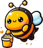

# Animals

> Source : [Animals](https://jeuxdecartes1.e-monsite.com/pages/jeux-de-bataille/animals.html)

♦ **Matériel** : Un jeu de 52 cartes (sans Joker)

♦ **Nombre de joueurs** : Entre 4 et 8 joueurs

♦ **Objectif** : Avoir en sa possession plus de cartes que ses adversaires

♦ **Règle du jeu** : ***Animals*** est une variante du [***Snap***](http://jeuxdecartes1.e-monsite.com/pages/jeux-de-bataille/le-snap.html) dans laquelle chaque joueur choisit un animal, différent de ses adversaires, avant de commencer. Le donneur, désigné pour la partie, distribue les cartes, une à une, face visible, devant chaque joueur. Dès lors qu’apparaissent deux cartes de même valeur, les deux joueurs concernés doivent crier le ***nom de l’animal*** choisi par l’autre joueur. Le premier à l’énoncer correctement gagne la pile de son adversaire et la glisse sous sa propre pile. Le gagnant est le joueur ayant collecté le plus de cartes une fois que toutes les cartes ont été distribuées.

---

♦ **Variante** : Une variante du jeu, connue sous le nom de ***Barnyard Snap***, propose aux joueurs de jouer avec les cris d’animaux. Ainsi, lorsque deux joueurs voient leur pile afficher la même valeur de carte, ils doivent ***imiter le bruit de l’animal*** choisi par leur adversaire. Voici quelques exemples :

|  | L’abeille : *Bzzz bzzz* |
|---|---|
|  | L’âne : *Hi han* |
|  | Le canard : *Coin coin* |
|  | Le chat : *Miaou* |
|  | La chèvre : *Bêêêêê* |
