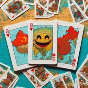

# Big Three

> Source : [Big Three](https://jeuxdecartes1.e-monsite.com/pages/jeux-d-escalade/big-three.html)

♦ **Matériel** : Un jeu de 52 cartes (sans Joker) et éventuellement quelques jetons

♦ **Nombre de joueurs** : À 3 joueurs (variante à 4 joueurs)

♦ **Objectif** : Se débarrasser le premier de toutes ses cartes

♦ **Nombre de cartes pour chaque joueur** : 16 cartes

♦ **Valeur des cartes, de la plus faible à la plus forte** : 4 – 5 – 6 – 7 – 8 – 9 – 10 – Valet – Dame – Roi – As – 2 – 3

♦ **Règle du jeu** : ***Big Three*** (***Da San***), aussi connu sous le nom de ***Dig a Hole*** (***Wa Keng***), est un jeu de cartes chinois, originaire de la province du Shaanxi. En début de partie, un joueur distribue 16 cartes à chaque joueur, en commençant par lui-même, puis en poursuivant par le joueur à sa droite. Les 4 cartes restantes sont posées sur la table, face cachée, jusqu’à la fin de l’enchère (*voir ci-après*). Par la suite, c’est le gagnant de chaque partie (le premier joueur n’ayant plus de cartes en main) qui distribue pour la partie suivante.

L’enchère : Elle détermine quel joueur jouera seul ***contre*** les deux autres. Les seules enchères possibles sont ***1***, ***2*** et ***3***. Le joueur possédant le ♥4 (ou la carte la plus basse à ♥, si le ♥4 se trouve parmi les 4 cartes non encore distribuées) commence par enchérir – au moins 1. L’enchère se poursuit dans le sens antihoraire, chaque joueur ayant le choix de passer ou d’enchérir plus haut que le précédent enchérisseur, jusqu’à ce que deux joueurs consécutifs passent ou que l’un d’entre eux enchérisse 3. Le dernier enchérisseur ajoute à sa main les 4 cartes restantes ; il a donc 20 cartes en main.

Indépendamment de celui qui a remporté l’enchère, le joueur ayant parlé en premier lors de l’enchère joue également en premier. Voici les combinaisons pouvant être posées :

- **Une seule carte**
- **Une paire** : 2 cartes de même valeur
- **Un brelan** : 3 cartes de même valeur
- **Un carré** : 4 cartes de même valeur
- **Une suite d’au moins 3 cartes** (comme 4 - 5 - 6 ou 8 - 9 - 10 - Valet - Dame)
- **Une suite d’au moins 3 paires** (comme 6 - 6 - 7 - 7 - 8 - 8 - 9 - 9)
- **Une suite d’au moins 3 brelans**
- **Une suite d’au moins 3 carrés**

Attention, ***l**es **As, les 2 et les 3 ne peuvent pas être utilisés dans les suites*** (suites simples, suites de paires, suites de brelans et suites de carrés) !

Une fois que le premier joueur a joué, le joueur suivant (dans le sens antihoraire) doit passer son tour ou bien jouer une combinaison de plus grande valeur, de même nature et comptant le même nombre de cartes. Par exemple, sur la combinaison 6 - 7 - 8 - 9, un joueur peut jouer 7 - 8 - 9 - 10 ou bien 10 - Valet - Dame - Roi, mais pas 8 - 9 - 10 - Valet - Dame (trop de cartes),  ni même 6 - 7 - 8 - 9 (valeur trop faible), ni même encore 10 - 10 - 10 - 10 (ce n’est pas une suite). Le tour continue jusqu’à ce que deux joueurs passent consécutivement ; les cartes jouées sont retournées et écartées et le joueur ayant posé la combinaison de plus grande valeur entame le tour suivant avec la combinaison de son choix. Le jeu continue jusqu’à ce qu’un joueur n’ait plus aucune carte en main.

Si l’enchérisseur se débarrasse le premier de toutes ses cartes, il gagne et ses adversaires lui paient chacun le montant de l’enchère : 1, 2 ou 3 unités. En revanche, si c’est l’un des deux joueurs alliés qui se débarrasse en premier de toutes ses cartes, l’enchérisseur perd et doit payer le montant de l’enchère à chacun de ses deux adversaires.

---

♦ **Variante (à 4 joueurs)** : Chaque joueur reçoit ***13 cartes*** (il n’y a donc pas de cartes écartées en début de jeu) et le plus offrant nomme une carte spécifique, du 4 au 10, qui n’est pas dans sa main ; son détenteur devient son allié pour la partie. Le jeu se déroule comme dans la version à 3 joueurs, à ceci près que trois passes consécutives sont nécessaires pour que le tour s’achève et pour que le joueur de la dernière et plus haute combinaison redémarre avec une nouvelle combinaison. Le premier joueur à court de cartes fait gagner son équipe et les deux joueurs de l’équipe perdante paient chacun le montant de l'enchère aux deux joueurs victorieux.
