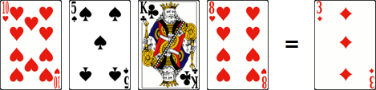

# Brain Drain

> Source : [Brain Drain](https://jeuxdecartes1.e-monsite.com/pages/jeux-d-addition/brain-drain.html)

♦ **Matériel** : Un jeu de 52 cartes (sans Joker)

♦ **Nombre de joueurs** : Entre 2 et 8 joueurs

♦ **Objectif** : Résoudre des opérations pour remporter un maximum de cartes

♦ **Règle du jeu** : Dans cette variante sympathique du ***[24](https://jeuxdecartes1.e-monsite.com/pages/jeux-d-addition/le-24.html)***, imaginée par David Parlett, quatre cartes sont disposées face visible sur la table et une cinquième carte, appelée carte cible, est retournée à côté.

Les As et les figures comptent pour 1 et les autres cartes, du 2 au 9, comptent pour leur valeur numérique. L’objectif est d’obtenir la valeur de la carte cible en combinant entre elles ***l’ensemble des quatre autres cartes*** et en utilisant exclusivement l’addition, la soustraction, la multiplication et la division (la division doit être intégrale, c’est-à-dire sans reste).

Voici un exemple :

Les joueurs doivent tenter de faire 3 en combinant les quatre nombres suivants : 10, 5, 1 et 8. Quelques solutions possibles : (5 x 8 / 10) – 1 = 3, (5 / 1) – (10 – 8) = 3 ou encore 5 + 8 – (10 / 1) = 3.

Le premier joueur à trouver une équation valide remporte la carte cible, jette les quatre autres dans une pile de défausse et procède à une nouvelle distribution (quatre nouvelles cartes ainsi qu’une nouvelle carte cible). Quiconque donne une équation invalide ne peut plus retenter sa chance pour la carte cible actuelle. Si tout le monde passe, la carte cible est remise sous la pioche et remplacée par la carte du dessus. À deux, lorsqu’un joueur se trompe, c’est son adversaire qui décroche la carte cible.

Quand il ne reste plus que deux cartes dans la pioche, celles-ci sont ajoutées à la pile de défausse, et l’ensemble des cartes est mélangé pour former une nouvelle pioche. Le jeu continue jusqu’à ce que ***48 cartes*** aient été gagnées (les quatre cartes restantes sont remportées par le joueur ayant réalisé la dernière opération). Le gagnant est le joueur ayant gagné le plus de cartes, ou, si convenu au préalable, celui dont la valeur additionnée des cartes est la plus grande. À deux joueurs toutefois, le jeu peut s’arrêter lorsqu’un joueur a remporté 12 cartes (ou tout autre nombre fixé à l’avance).
