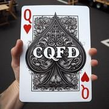

# C.Q.F.D.

> Source : [C.Q.F.D.](https://jeuxdecartes1.e-monsite.com/pages/jeux-d-enquete/c-q-f-d-.html)

♦ **Matériel** : Un jeu de 32 cartes (sans Joker), deux supports pour 7 cartes et des feuilles de marque

♦ **Nombre de joueurs** : À 2 joueurs

♦ **Objectif** : Deviner la valeur des 7 cartes secrètes de son adversaire

♦ **Nombre de cartes pour chaque joueur** : 7 cartes (disposées sur un support)

♦ **Règle du jeu** : ***C.Q.F.D.***, acronyme de ***Cartes Qu’il Faut Deviner***, est un jeu d’enquête conçu par Max Gerchambeau dans lequel il faut deviner ***la valeur des 7 cartes secrètes*** de son adversaire. Après mélange du paquet, les cartes sont distribuées une à une, face cachée. Les joueurs les disposent ensuite sur leur support dans l’ordre suivant : As, Roi, Dame, Valet, 10, 9, 8, 7.

À tour de rôle, chacun interroge son adversaire, tentant de démasquer les 7 cartes qu’il tient secrètes. Le joueur interrogé doit préciser quelle quantité de cartes citées par le questionneur il possède réellement. Les questions doivent être écrites sur la feuille de marque et porter sur ***7 cartes*** réparties sur ***3 cases minimum*** (par exemple : « *Tu as 1 As, 1 Roi, 1 Dame et 4 Valets* »). Les réponses de l’adversaire et les déductions qu’en tire le questionneur, quant à elles, doivent être inscrites dans les deux colonnes de droite (« Réponses » et « Déductions »).

Si le joueur interrogé ne possède aucune des cartes citées, il répond 0 ; s’il en possède, il en donne le total, sans autre précision. Après avoir répondu, c’est à son tour de poser une question. Le gagnant est le premier joueur à deviner, en moins de douze questions, le jeu secret de son adversaire.

Exemple dans lequel un joueur devine en 9 questions les 7 cartes secrètes de son adversaire :

| **      Questions      ** | **      As      ** | **      Roi      ** | **      Dame      ** | **      Valet      ** | **      10      ** | **      9      ** | **      8      ** | **      7      ** | **      Réponses      ** | **      Déductions      ** |
|---|---|---|---|---|---|---|---|---|---|---|
| 1) Hypothèse de départ. | **      1      ** | **      1      ** | **      1      ** | **      4      ** | **        ** | **  ** | **** | **** | 2 | Aucune |
| 2) Je supprime l’As pour savoir s’il en possède un. | **** | **2** | **1** | **4** | **** | **** | **** | **** | 2 | Même réponse. Il n’a donc pas d’As. |
| 3) Je questionne pour 4 As afin de savoir le nombre de Dames et de Rois. | **4** | **2** | **1** |  | **** | **** | **** | **** | 2 | La réponse reste 2 : il n’a ni As ni Valet. Si je compare avec la question 1), je suis sûr qu’il a un Roi maximum et une ou plusieurs Dames. |
| 4) Je questionne pour 4 Dames afin de connaître le nombre de Dames et de Rois. | **2** | **1** | **4** | **** | **** | **** | **** | **** | 2 | La réponse reste 2 : il a un Roi et une Dame. |
| 5) Les 5 cartes qui restent à deviner sont réparties sur les 10, 9, 8 et 7. | **** | **** | **** | **** | **1** | **1** | **1** | **4** | 4 | Pas de déduction. |
| 6) Je supprime les 7 pour savoir s’il en possède un ou plusieurs. | **** | **** | **** | **4****** | **1** | **1** | **1** | **** | 3 | Sa réponse indique une carte de moins qu’à la question précédente : il a donc un 7. |
| 7) A-t-il une paire de 10 et un 9 ? | **** | **** | **** | **4****** | **2****** | **1****** | **** | **** | 2 | Il a au moins un 10 et un 9. Comme la réponse est tombée à 2, je sais qu’il a aussi au moins un 8. |
| 8) Il a probablement une paire de 9. Vérifions. | **** | **** | **** | **4****** | **1****** | **2****** | **** | **** | 3 | Je connais toutes ses cartes ! |
| 9) Je crois avoir deviné le jeu gagnant. | **** | **1****** | **1****** | **** | **1****** | **2****** | **1****** | **1****** | 7 | Hypothèse vérifiée. C.Q.F.D. |

Voici la feuille de marque : 
