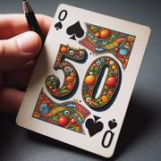

# Cinquante Plus/Moins

> Source : [Cinquante Plus/Moins](https://jeuxdecartes1.e-monsite.com/pages/jeux-d-addition/cinquante-plus-moins.html)

♦ **Matériel** : Un jeu de 52 cartes (sans Joker)

♦ **Nombre de joueurs** : Entre 2 et 6 joueurs

♦ **Objectif** : Atteindre 50 en ajoutant et soustrayant des valeurs de carte

♦ **Nombre de cartes pour chaque joueur** : 4 cartes

♦ **Règle du jeu** : Dans ce jeu d’addition inventé par une jeune fille prénommée Dani, les joueurs doivent additionner ou soustraire les valeurs des cartes pour arriver à un score gagnant de 50.

Le jeu se joue dans le sens horaire et le joueur à gauche du donneur commence. À son tour, chacun pose une carte de son jeu sur la défausse, face visible, énonce la nouvelle valeur de la pile – valeur qu’il affecte en fonction de la carte qu’il joue – et pioche une nouvelle carte pour remplacer celle qu’il vient de jeter.

La valeur de la pile de défausse est initialement à 0 et, tant que celle-ci reste inférieure à 50, chaque carte jouée est ***additionnée***. En revanche, si une carte fait grimper la valeur de la pile au-delà de 50, alors la valeur de la carte est ***soustraite***. Le joueur qui fait monter la valeur de la pile à ***exactement 50*** est déclaré gagnant.

La valeur des cartes :

- **As**, **2**, **3**, **4**, **5**, **7**, **8**, **9** et **10** : valeur numérique (de 1 à 10 points)
- **Valet**, **Dame** et **Roi** : 10 points
- **6** : 0 point
