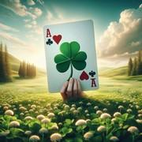

# Clubbed

> Source : [Clubbed](https://jeuxdecartes1.e-monsite.com/pages/jeux-d-appariemment/clubbed.html)

♦ **Matériel** : Un jeu de 52 cartes (sans Joker)

♦ **Nombre de joueurs** : À 2 joueurs

♦ **Objectif** : Forcer son adversaire à stocker le maximum de cartes

♦ **Nombre de cartes pour chaque joueur** : 5 cartes

♦ **Règle du jeu** : ***Clubbed*** est un jeu inventé par Dave Cline et sa fille Kendall. Un joueur distribue 5 cartes à chaque joueur, face cachée, pose la pioche au centre et retourne à côté la première carte, qui constitue la défausse. À son tour de jouer, chaque joueur jette une carte de sa main dans la pile de défausse :

- Soit une carte de même couleur – ♠, ♦ et ♥ – que la carte face visible ;
- Soit une carte de même valeur que la carte face visible ;
- Soit un ♣.

En début de partie, si la première carte de la défausse est un ♣, le premier joueur peut jouer n’importe quelle carte de sa main.

Les joueurs doivent jouer une carte à chaque tour. Par conséquent, un joueur qui n’a pas de carte jouable doit tirer des cartes de la pioche jusqu’à ce qu’il puisse jouer une carte. Un joueur ayant une carte de même couleur ou de même valeur que la carte visible n’est pas autorisé à piocher. Chaque fois qu’un ♣ est joué sur la défausse, toute la pile de cartes jouées est donnée à l’adversaire du joueur, qui stocke les cartes face cachée, l’objectif étant de forcer son adversaire à stocker le maximum de cartes.

Après une attaque au ♣, la défausse est vide, et le joueur ayant été battu commence une nouvelle pile ouverte en jouant n’importe quelle carte, éventuellement un ♣ (mais s’il n’a que des ♣, il peut, s’il le souhaite, commencer par piocher jusqu’à ce qu’il obtienne une carte d’une autre couleur). Quand un joueur joue la dernière carte de sa main, il pioche une nouvelle main de 5 cartes. Quand la pioche est épuisée, le jeu continue sans pioche jusqu’à ce qu’un joueur ne puisse pas jouer de carte à son tour. Chaque joueur ajoute ensuite les cartes restantes de sa main à sa réserve de cartes face cachée. Les cartes restantes dans la défausse sont laissées sur la table et n’appartiennent à aucun joueur. Le joueur ayant le moins de cartes dans son stock gagne la partie.
