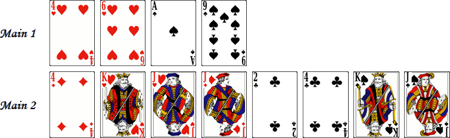

# Crapaud

> Source : [Crapaud](https://jeuxdecartes1.e-monsite.com/pages/jeux-de-pioche-defausse/crapaud.html)

♦ **Matériel** : Un jeu de 52 cartes (sans Joker) et des pièces ou des jetons

♦ **Nombre de joueurs** : Entre 2 et 6 joueurs

♦ **Objectif** : Obtenir 10 points avec les cartes rouges et 10 points avec les cartes noires

♦ **Nombre de cartes pour chaque joueur** : 2 cartes

♦ **Règle du jeu** : ***Crapaud*** (***Toad*** pour le jeu original) est un jeu de cartes inventé en 1980 par Richard Smith pendant qu’il était au Totton College en Angleterre, où le jeu y est devenu populaire. Dans ce jeu, les joueurs incarnent des têtards en maturation dans un étang ayant besoin d’obtenir ***10 points rouges*** et ***10 points noirs*** pour être acceptés en tant que crapauds adultes. Le jeu est traditionnellement joué avec ***3 vies***, représentées par des pièces ou des jetons. À chaque tour, le dernier joueur à obtenir les points nécessaires perd une vie et est éliminé s’il ne lui reste plus de vies – les vies perdues constituent le pot. Le dernier joueur survivant gagne la partie. Chaque joueur reçoit deux cartes ; ensuite, quatre cartes, face visible, sont disposées au milieu des joueurs, et le reste constitue la pioche, face cachée.

À son tour de jouer, au choix :

1) Le joueur prend l’une des quatre cartes face visible (que l’on remplace immédiatement par une carte de la pioche) ;

2) Le joueur prend la première carte de la pioche ;

3) Le joueur prend la première carte de la défausse, s’il y en a au moins une ;

4) Le joueur choisit de ne pas tirer de cartes.

Ensuite, le joueur choisit ou bien de se défausser d’une carte (face visible), ou bien de n’en jeter aucune. Enfin, il déclare éventuellement être devenu ***Crapaud***. C’est au tour du joueur suivant, le jeu s’opérant dans le sens horaire.

Un joueur qui devient crapaud dit « ***Coa Coa !*** », montre ses cartes et ne joue plus le temps que la manche se termine, satisfait de ne perdre aucune vie. Cependant, si sa revendication est fausse (le total des cartes est incorrect), le joueur continue, mais avec le désavantage que ses adversaires savent les cartes qu’il a en main. Pour devenir un crapaud, le joueur doit avoir exactement ***10 points rouges et 10 points noirs***, ni plus ni moins. Chaque As compte 1 point et chaque figure en compte 2 ; les autres cartes valent autant de points que l’indique leur valeur numérique. Un crapaud peut être réalisé à partir de n’importe quel nombre de cartes, par exemple :

La main de crapaud suprême est constituée d’un 10 rouge et d’un 10 noir :

Un joueur qui réalise cette main peut revendiquer la restauration d’une vie (s’il en a déjà perdu au moins une).

Si tous les joueurs passent (c’est-à-dire qu’ils ne prennent aucune carte et n’en jettent aucune), le tour de jeu se termine et tous les joueurs n’étant pas devenus crapauds perdent une vie.
