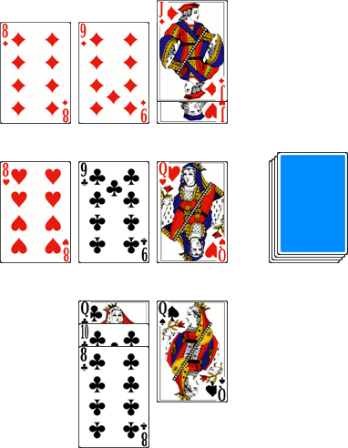

# East-West

> Source : [East-West](https://jeuxdecartes1.e-monsite.com/pages/jeux-d-appariemment/east-west.html)

♦ **Matériel** : Un jeu de 32 cartes (sans Joker)

♦ **Nombre de joueurs** : À 2 joueurs

♦ **Objectif** : Réaliser des combinaisons de poker plus fortes que son adversaire

♦ **Valeur des cartes, de la plus faible à la plus forte** : 7 – 8 – 9 – 10 – Valet – Dame – Roi – As

♦ **Règle du jeu** : ***East-West***, précurseur de ***Schotten Totten*** et ***Battle Line***, est un jeu imaginé par Reiner Knizia. D’abord, trois cartes, communes aux deux joueurs, sont disposées face visible au centre de la table ; les cartes restantes forment la pioche, face cachée. Ensuite, à tour de rôle, chaque joueur pioche une carte et la place devant l’une des trois cartes centrales, de son côté, afin de constituer avec elle une combinaison de poker plus forte que celle de son adversaire. Voici la disposition du jeu après quelques tours :

Rappel des combinaisons au poker, de la plus faible à la plus forte :

- **La carte haute**
- **La paire** : deux cartes de même valeur
- **La double-paire** : deux paires
- **Le brelan** : trois cartes de même valeur
- **La quinte** : cinq cartes qui se suivent
- **La couleur** : cinq cartes de la même couleur
- **Le full** : une paire et un brelan
- **Le carré** : quatre cartes de même valeur
- **La quinte floche** : cinq cartes de même couleur qui se suivent

Remarque : Avec un jeu de 32 cartes, d’un point de vue probabiliste, la couleur est plus difficile à obtenir que le full et le carré. Si l’usage tend à conserver la hiérarchie habituelle des mains, certains joueurs choisissent d’intercaler la couleur entre le full et le carré, voire entre le carré et la quinte floche.

Si les deux joueurs ont la même combinaison, c’est la valeur des cartes la constituant qui départage : ainsi, un brelan de Rois est plus fort qu’un brelan de 8. Dans la double-paire, on compare la valeur de la paire la plus haute ; dans le full, la valeur du brelan ; dans le quinte et la couleur, la valeur de la carte la plus haute. En cas de nouvelle égalité, on compare la valeur de la deuxième meilleure carte ou du deuxième meilleur groupe de cartes. Et ainsi de suite.

La manche prend fin lorsque chacun a joué ses douze cartes et constitué ses trois combinaisons de cinq cartes. Le gagnant de chaque manche marque ***1 point*** s’il a deux combinaisons gagnantes et ***2 points*** s’il a les trois. Une partie se joue traditionnellement en plusieurs manches et le gagnant est le premier joueur à atteindre un total de points convenu.
