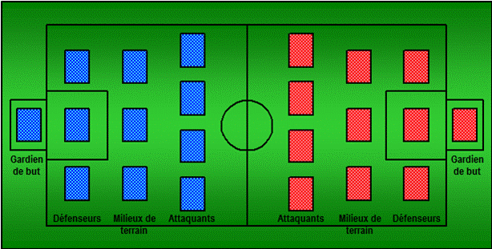

# Fotboll

> Source : [Fotboll](https://jeuxdecartes1.e-monsite.com/pages/jeux-de-bataille/fotboll.html)

♦ **Matériel** : Deux jeux de 52 cartes (et 1 à 4 Jokers, au choix, dans la variante)

♦ **Nombre de joueurs** : À 2 joueurs

♦ **Objectif** : Marquer plus de buts que son adversaire

♦ **Nombre de cartes pour chaque joueur** : Un jeu standard de 52 cartes (avec éventuellement 1 ou 2 Jokers)

♦ **Valeur des cartes, de la plus faible à la plus forte** : 2 – 3 – 4 – 5 – 6 – 7 – 8 – 9 – 10 – Valet – Dame – Roi – As

♦ **Règle du jeu** : ***Fotboll*** (qui veut dire ***Football*** en suédois) est un jeu imaginé par Roland Johansson qui simule une partie de football. Au préalable, chaque joueur reçoit un jeu standard de 52 cartes (avec éventuellement un ou plusieurs Jokers). Ensuite, l’un et l’autre piochent 11 cartes dans leur paquet et les disposent, face cachée, sur un terrain de jeu virtuel, à l’image d’un terrain de football – cartes qu’ils pourront à tout instant regarder après les avoir posées :

Chaque joueur conserve à côté de lui, face cachée, son paquet de cartes restantes.

À son tour de jouer, le joueur attaque son adversaire : pour ce faire, il prend la première carte de sa pioche et cible l’une des cartes de son adversaire, dans l’ordre suivant :

1) **Un attaquant**

2) **Un milieu de terrain**

3) **Un défenseur**

4) **Le gardien de but**

Chaque fois, si sa carte est d’une valeur supérieure ou égale à celle de son adversaire, il gagne. Il jette sa carte dans sa pile de défausse – de même que son adversaire, qui retire et jette la carte vaincue –, pioche une nouvelle carte, et cible une autre carte dans le jeu adverse. Ainsi, pour tenter de vaincre un milieu de terrain, il doit avoir préalablement vaincu un attaquant (cf. ordre défini ci-avant). Lorsqu’une carte de chaque ligne a été retirée, il peut tenter de défier le gardien pour*** marquer un but***. De nouveau, si sa carte est d’une valeur supérieure ou égale à la carte du gardien adverse, il marque un but ! C’est au tour du joueur suivant. En revanche, chaque fois que sa carte est d’une valeur inférieure à celle de son adversaire, il perd et jette sa carte dans sa pile de défausse. Son adversaire laisse sa carte sur le terrain, face cachée : c’est à son tour de jouer.

Avant d’attaquer, le joueur peut poser de nouvelles cartes de défense à l’endroit où elles ont été prises ou attaquées, et éventuellement, lorsque toutes les cartes manquantes ont été remplacées, faire des ***remplacements***. Dans ce dernier cas, avant de remplacer l’une de ses cartes, le joueur doit montrer la carte qu’il jette à son adversaire. Il n’est pas permis de remplacer plusieurs fois la même carte au cours du même tour, et seulement ***trois remplaçants*** sont autorisés lors d’un match complet.

Le jeu continue jusqu’à ce que la pioche de chaque joueur soit épuisée. Si la pioche d’un joueur est vide quand c’est son tour de jouer, le tour est donné à son adversaire, qui poursuit jusqu’à ce que sa pioche soit vide également. C’est la ***mi-temps*** : pendant ce temps, les joueurs rassemblent toutes leurs cartes, les mélangent, et disposent de nouveau 11 cartes comme en début de jeu. La deuxième partie commence alors, comme la première, et c’est le joueur n’ayant pas entamé la première qui entame celle-ci. Le gagnant est le joueur ayant marqué le plus de buts à la fin du match.

---

♦ **Variante (version avec Jokers) ** : Les Jokers bénéficient de règles spéciales ; leur valeur est supérieure à l’As mais* **chaque Joker attaqué une fois doit être retiré du terrain de jeu***. De plus, si un joueur attaque un Joker avec un ♦ :

1) Il a droit à ***un penalty*** si c’est un gardien ou un défenseur. Dans ce cas, l’attaquant pioche deux nouvelles cartes et ajoute les deux valeurs (les cartes du 2 au 10 ont leur valeur numérique, le Valet vaut 11, la Dame 12, le Roi 13, l’As 1 et le Joker 0). Si leur valeur ajoutée est supérieure ou égale à celle du gardien (la valeur du gardien est comptée comme celle des cartes attaquantes, hormis l’As et le Joker, qui valent 15 chacun), le joueur marque un but. C’est ensuite au tour de son adversaire.

2) Son adversaire reçoit ***un avertissement*** –  **carton jaune**  – si c’est un milieu de terrain ou un attaquant. Si un joueur reçoit deux avertissements –  **carton rouge**  – au cours d’un match, l’une de ses cartes, au choix, est renvoyée. L’autre joueur a donc une ligne de moins à passer pour marquer un but.
