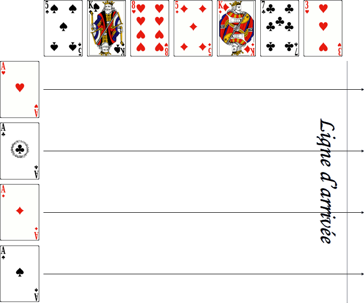

# Horse Race

> Source : [Horse Race](https://jeuxdecartes1.e-monsite.com/pages/jeux-de-course/horse-race.html)

♦ **Matériel** : Un jeu de 52 cartes, des jetons ou de la fausse monnaie (billets de ***Monopoly*** par exemple) pour les paris, et un Joker dans une variante

♦ **Nombre de joueurs** : Entre 3 et 10 joueurs

♦ **Objectif** : Miser sur le cheval gagnant pour multiplier ses gains

♦ **Règle du jeu** : ***Horse Race ***est un jeu de course et de paris. Le meneur de jeu (ou croupier), désigné pour la partie, retire du paquet les 4 As, qu’il dispose sur la ligne de départ. Ensuite, il mélange et coupe le paquet, puis dispose 7 cartes, face visible, représentant l’échelonnage du parcours, sur une ligne horizontale :

S’il y a cinq cartes ou plus d’une même couleur dans la rangée du haut, le meneur de jeu retire les cartes, les remet dans le paquet, mélange et redistribue ; en effet, il est impossible pour un cheval de terminer sa course dans cette configuration.

Les paris** **: Ensuite, le croupier (qui ne prend pas part aux paris) définit les cotes de chaque cheval. Les cotes désignent les chances qu’un cheval a de gagner la course. En effet, plus une couleur apparaît dans la rangée du haut, moins il est probable que le cheval de cette couleur gagne. De fait, voici une suggestion des cotes de chaque cheval en fonction du nombre de cartes de même couleur dans la rangée du haut ; suggestion à laquelle peut se fier le croupier :

| **Nombre de cartes de même couleur** | **Cotes** |
|---|---|
| **0** | *1.1* |
| **1** | *2.1* |
| **2** | *3.1* |
| **3** | *5.1* |
| **4** | *10.1* |

Par exemple, une cote de 5.1 (5 contre 1) signifie qu'en cas de victoire du cheval sur lequel le joueur a misé, le bénéfice sera de 5 fois le montant de la mise, soit un gain total de 6 (5+1) fois le montant de sa mise. Ainsi, un cheval ayant une cote de 5 contre 1 sur lequel un joueur mise 10 jetons lui rapporte 60 jetons. Chaque joueur, ayant reçu un même nombre de jetons ou une même somme d’argent en début de jeu, place sa mise à la hauteur de l’As (le cheval) sur lequel il décide de parier ; le croupier détermine la taille maximale des paris autorisés.

La course : Ensuite, le croupier retourne les cartes du dessus de son paquet, les unes après les autres. Ils les posent, face visible, sur le terrain de jeu : chaque fois, le cheval correspondant à la couleur de la carte retournée avance d’un échelon. Le premier cheval à franchir la ligne d’arrivée (ce qui arrive lorsque 8 cartes de même couleur ont été jouées) gagne la course ; le jeu s’arrête alors. Le croupier paie les paris sur le cheval gagnant et récupère les paris sur les autres. C’est ensuite au joueur suivant d’assurer la fonction de croupier.

---

♦ **Variantes ** :

1) La longueur de la course peut être réduite en abaissant la rangée du haut à 5 ou 6 cartes.

2) Un Joker peut être ajouté au jeu après échelonnage du parcours : s’il est tiré, tous les chevaux (à l’exception du ou des premiers, dont on dit qu’ils ***trébuchent*** ou ***font un faux pas***) avancent d’une carte.

3) Dans une variante, les 7 cartes représentant l’échelonnage sont disposées face cachée. Lorsqu’un As arrive pour la première fois à hauteur d’une carte, celle-ci est retournée, et l’As de même couleur recule d’une carte (s’il est encore sur la ligne de départ, il ne recule pas davantage) ; on dit que le cheval ***vacille*** ou ***faiblit***. Dans cette version, les cotes sont toutes de 1.1. Voici l’exemple d’une partie en cours :

