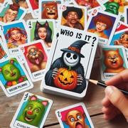

# Identité

> Source : [Identité](https://jeuxdecartes1.e-monsite.com/pages/jeux-de-memoire/identite.html)

♦ **Matériel** : Un jeu de 32 cartes (sans Joker) duquel on conserve les 10, les Valets, les Dames, les Rois et les As

♦ **Nombre de joueurs** : À 4 joueurs (variante à 2 ou 3 joueurs)

♦ **Objectif** : Deviner sa propre carte le plus rapidement possible

♦ **Nombre de cartes pour chaque joueur** : 1 carte face cachée

♦ **Règle du jeu** : Ce petit jeu sympathique mêle habilement mémoire et enquête. Chaque joueur reçoit une carte, qu’il dispose sur son front ou derrière un objet afin que tous puissent la voir, sauf lui-même. Les seize cartes restantes sont disposées au centre, face cachée, formant une grille de 4x4.

À tour de rôle, les joueurs retournent une carte de la grille. Si la carte révélée n’est pas de la même valeur ou de la même couleur que la carte retournée juste avant, alors celle-ci (la première des deux) est retournée face cachée. En revanche, si la carte révélée est de même valeur ou de même couleur que la carte précédente, alors celle-ci reste visible jusqu’à la fin de la manche. Précision importante, un joueur peut révéler une carte qui a déjà été retournée plus tôt.

Dès lors qu’un joueur pense avoir deviné quelle est sa propre carte, il peut donner une réponse (mais il ne peut le faire qu’une seule fois). La manche continue jusqu’à ce qu’il ne reste qu’un joueur à ne pas avoir soumis de réponse. À ce moment-là, les joueurs regardent leur propre carte pour vérifier. S’ils ont vu juste, le premier joueur à avoir donné sa réponse marque ***3 points***, le deuxième marque ***2 points*** et le troisième marque ***1 point***. Après plusieurs manches, le premier joueur à ***10 points*** gagne la partie.

---

♦ **Variante (à 2 ou 3 joueurs)** : Chacun reçoit une carte, et une ou deux autres cartes sont posées face visible de sorte que toujours quatre cartes soient distribuées au total. À 2 joueurs, le premier à donner une réponse juste marque ***1 point*** ; à 3 joueurs, le premier à viser juste marque ***2 points*** et le deuxième marque ***1 point***.
