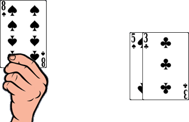

# Kontsina

> Source : [Kontsina](https://jeuxdecartes1.e-monsite.com/pages/jeux-de-peche/kontsina.html)

♦ **Matériel** : Un jeu de 52 cartes (sans Joker)

♦ ** Nombre de joueurs** : À 2 joueurs (variante à 3 ou 4 joueurs)

♦ **Objectif** : Capturer des cartes pour marquer un maximum de points

♦ **Nombre de cartes pour chaque joueur** : 4 cartes

♦ **Règle du jeu** : ***Kontsina***, autrement nommé ***Koltsina*** ou ***Kolitsina***, est un sympathique jeu de cartes grec. En début de partie, un joueur distribue 4 cartes à chaque joueur et en dispose 4 autres sur la table, face visible, les unes à côté des autres. Le reste du paquet, face cachée, est mis à l’écart. Le joueur n’ayant pas distribué commence. À son tour, chaque joueur doit jouer ***une carte de sa main*** pour effecteur l’une des trois actions suivantes :

1) Il capture une carte posée, face visible, en jouant une carte de valeur équivalente. Ainsi, un 7 peut capturer un 7, un Roi peut capturer un autre Roi etc. C’est d’ailleurs la seule façon de capturer une figure (un Valet, une Dame ou un Roi).

2) Il capture un ensemble de cartes numériques, face visible, dont la somme des valeurs est égale à la valeur numérique de la carte jouée (les As valent 1). Si plusieurs combinaisons de cartes distinctes produisent la même somme, une seule de ces combinaisons peut être capturée ; exemples :

Le 8 peut capturer les deux cartes.

Le 10 peut capturer les trois cartes.

Le 6 peut capturer le 6 ou bien capturer ensemble le 2 et le 4, mais pas les trois cartes.

Le 10 peut, au choix du joueur, capturer l’As, le 2 et le 7, capturer l’As, le 3 et le 6 ou capturer le 3 et le 7.

3) S’il ne peut ou ne souhaite pas capturer de cartes, il pose, à côté des autres cartes visibles sur la table, une carte de sa main. Celle-ci pourra être capturée plus tard grâce à l’une des deux méthodes précédemment décrites.

Chaque fois que des cartes sont capturées sur la table, elles sont ajoutées – ainsi que la carte jouée – à une pile de capture, face cachée, devant le joueur ayant fait la capture. Les cartes de cette pile ne peuvent être regardées avant la fin de la manche.

L’un après l’autre, les joueurs effectuent l’une des trois actions suivantes jusqu’à ce que leurs mains soient toutes les deux épuisées. Alors, le donneur distribue une nouvelle main de 4 cartes à partir du haut de la pile des cartes mise à l’écart, son adversaire ayant le privilège de commencer après chaque donne. Le jeu se poursuit jusqu’à ce que toutes les cartes aient été distribuées. Lorsque les joueurs ont joué leurs dernières cartes, toutes les cartes, face visible sur la table, sont ajoutées à la pile de capture du joueur ayant capturé la dernière carte. La manche se termine.

Chaque joueur examine les cartes de sa pile de capture et procède au décompte des points :

- **Les cartes** : Le joueur ayant capturé le plus de cartes marque ***2 points***. En cas d’égalité (26 cartes chacun), les cartes sont dites « divisées » et aucun joueur ne marque.
- **Les trèfles** : Le joueur ayant capturé la majorité des trèfles marque ***1 point***.
- **Le « bon 2 »** : Le joueur ayant capturé le ♣2 (cette carte compte également dans le total des trèfles) marque ***1 point***.
- **Le « bon 10 »** : Le joueur ayant capturé le ♦10 marque ***1 point***.

Le joueur marquant la majorité des points remporte la manche, et le joueur n’ayant pas distribué devient le donneur pour la manche suivante. Un nombre convenu de manches est joué, le vainqueur étant celui qui en gagne le plus.

---

♦ **Variantes** :

1) Plutôt que de simplement compter le nombre de manches gagnées, chaque joueur peut enregistrer le nombre de points accumulé à l’issue de chaque manche ; ainsi, le gagnant devient le premier joueur totalisant un certain nombre de points, préalablement convenu (par exemple 21). Si les deux joueurs atteignent la cible au cours de la même manche, celui ayant le score le plus élevé gagne. En cas d’égalité, une autre manche est jouée.

2) ***Kontsina*** peut se jouer à 3 ou 4 joueurs, dans le sens antihoraire, en commençant par le joueur à la droite du donneur. Quatre joueurs peuvent jouer en équipe, deux contre deux, des partenaires assis l’un en face de l’autre et combinant leurs cartes capturées en une seule pile.
