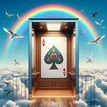

# L’Ascenseur

> Source : [L’Ascenseur](https://jeuxdecartes1.e-monsite.com/pages/jeux-de-levees/l-ascenseur.html)

♦ **Matériel** : Un jeu de 52 cartes (sans Joker)

♦ **Nombre de joueurs** : Entre 3 et 7 joueurs

♦ **Objectif** : Réaliser exactement le nombre de levées annoncé

♦ **Nombre de cartes pour chaque joueur** : 10 cartes (entre 3 et 5 joueurs), 8 cartes (à 6 joueurs) et 7 cartes (à 7 joueurs)

♦ **Valeur des cartes, de la plus faible à la plus forte** : 2 – 3 – 4 – 5 – 6 – 7 – 8 – 9 – 10 – Valet – Dame – Roi – As

♦ **Règle du jeu** : Apparu à Londres dans les années 1930 sous le nom de ***Oh Hell!***, ce jeu s’est ensuite rapidement popularisé dans le monde entier. En France, il porte le nom d’***Ascenseur***. Pour la première manche, 7 à 10 cartes sont distribuées à chaque joueur (voir ci-dessus). Chaque manche successive se joue avec une carte en moins, jusqu’à descendre à une seule carte, puis une carte est ajoutée à chaque nouvelle manche jusqu’au nombre initial. Le donneur pose la pioche au centre et retourne à côté la première carte, qui détermine la couleur de l’atout pour la manche. Les cartes non distribuées forment une pile, face cachée, avec l’atout retourné dessus.

Les enchères : En commençant par le joueur à gauche du donneur, chacun annonce le nombre de levées qu’il pense réaliser. Le donneur, dernier à enchérir, doit néanmoins respecter une règle : le nombre total de levées annoncées ne doit pas être égal au nombre de levées réalisables au cours de la manche ; en effet, il ne faut pas que tous les joueurs puissent simultanément réaliser leur contrat.

Le joueur à gauche du donneur pose la première carte. Les joueurs suivants répondent à la couleur demandée, coupent (jouent un atout) ou se défaussent d’une carte de leur choix. Le joueur ayant joué l’atout le plus fort ou, à défaut, la carte de plus forte valeur dans la couleur demandée, remporte la levée et entame le tour suivant.

En fin de manche, les joueurs marquent ***1 point*** pour chaque levée remportée et ***10 points*** de bonus s’ils ont rempli leur contrat. Chaque joueur est donneur tour à tour. Après la dernière manche, celui ayant totalisé le plus de points remporte la partie.

---

♦ **Variantes** :

1) On peut également procéder dans l’ordre inverse, c’est-à-dire commencer la première manche avec une seule carte, augmenter jusqu’au nombre maximum et redescendre.

2) Il est également possible de distribuer 17 cartes à 3 joueurs et 13 cartes à 4 joueurs. Dans ce cas, les manches dans lesquelles toutes les cartes sont distribuées se jouent sans atout.
