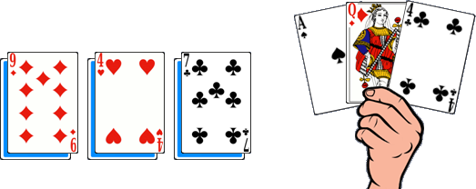

# La Bataille Norvégienne

> Source : [La Bataille Norvégienne](https://jeuxdecartes1.e-monsite.com/pages/jeux-d-attaque/la-bataille-norvegienne.html)

♦ **Matériel** : Un jeu de 52 cartes (sans Joker)

♦ **Nombre de joueurs** : Entre 3 et 5 joueurs

♦ **Objectif** : Se débarrasser le premier de toutes ses cartes

♦ **Nombre de cartes pour chaque joueur** : 9 cartes

♦ **Valeur des cartes, de la plus faible à la plus forte** : 2 – 3 – 4 – 5 – 6 – 7 – 8 – 9 – 10 – Valet – Dame – Roi – As – 2

♦ **Règle du jeu** : Ce jeu est également connu sous les noms de ***Norvégien***, ***Danish***, ***Palace*** ou ***Shithead***. Le donneur distribue 9 cartes à chaque joueur, une par une : 3 cartes face cachée, 3 cartes face visible disposées sur les trois premières et 3 autres cartes que les joueurs prennent en main. Les cartes non distribuées forment la pioche.

Avant de commencer, les joueurs peuvent échanger une ou plusieurs cartes de leur main avec leurs cartes face visible ; stratégiquement, il est préférable de prendre les cartes de plus faible valeur.

Le joueur situé à gauche du donneur commence en posant une ou plusieurs cartes de même valeur et en piochant aussitôt le nombre nécessaire de cartes pour reconstituer sa main (de trois cartes). Ensuite, à tour de rôle, chaque joueur pose une ou plusieurs cartes de même valeur, mais de valeur supérieure ou égale à celle(s) posée(s) par le joueur précédent ; s’il ne peut pas ou ne veut pas, ils ramasse la pile et l’ajoute à sa main ; le joueur situé à sa gauche redémarre alors en posant une ou plusieurs cartes de même valeur. Et ainsi de suite.

Tant qu’il reste des cartes dans la pioche, les joueurs réapprovisionnent leur main après avoir joué ; en revanche, dès lors qu’ils n’ont plus de cartes en main et que la pioche est épuisée, ils ramassent leurs trois cartes face visible ; la partie continue. S’ils parviennent à vider leur main une nouvelle fois, les joueurs choisissent au hasard l’une de leurs trois dernières cartes face cachée : si celle-ci est jouable, ils la posent et choisissent une autre carte pour le tour suivant ; sinon, ils ramassent la pile et l’ajoute à leur main, avec la carte retournée (il leur faudra alors se défaire des cartes de leur main avant de pouvoir retourner la prochaine carte). Le gagnant est le premier joueur à s’être débarrassé de toutes ses cartes (celles posées devant lui et celles de sa main) ; il est appelé ***Norvégien***.

Certaines cartes ont un effet spécial lorsqu’on les pose :

- **Le 2** : Comme un Joker, le 2 peut être joué sur n’importe quelle valeur de carte, et n’importe quelle valeur peut être jouée sur un 2.
- **Le 10** : Lorsqu’un 10 est joué, les cartes de la pile de défausse sont retirées du jeu ; le joueur doit alors rejouer en commençant une nouvelle pile. Attention néanmoins, le 10 peut être joué sur n’importe quelle valeur de carte ou sur une défausse vide, mais un joueur qui joue un 10 comme dernière carte est éliminé (la partie continue pour les autres joueurs).
- **Le Carré** : Si un joueur pose ou complète un ensemble de quatre cartes de même valeur, alors la pile entière est retirée du jeu ; le joueur en question rejoue en démarrant une nouvelle pile de défausse.

---

♦ **Variantes** :

1) Dans certaines versions du jeu, il n’y a pas un gagnant mais un perdant, il s’agit du dernier joueur à avoir encore des cartes en main : c’est le ***Shithead***. Celui-ci devient donneur pour la partie suivante.

2) En plus du 2 et du 10, d’autres cartes à pouvoir sont communément utilisées :

- **Le 7** : Lorsqu’un 7 est joué, le joueur suivant doit impérativement jouer une ou plusieurs cartes de valeur inférieure ou égale.
- **Le 8** : Un 8 fait passer le tour du joueur suivant. Deux 8 font passer le tour des deux joueurs suivants. Et ainsi de suite.
- **L’As** : Le joueur qui pose un As donne les cartes de la pile de défausse au joueur de son choix ; ce dernier peut néanmoins contrer l’attaque en jouant un 2, un 10 ou un autre As. À défaut, il doit ramasser l’ensemble des cartes. Le 10 lui permet de rejouer après le retrait de la pile et l’As lui permet d’attaquer à son tour le joueur de son choix. Si l’attaque n’a pas été contrée ou si elle a été contrée avec un 2 ou un As, le joueur situé à gauche du dernier ayant joué reprend la main.
