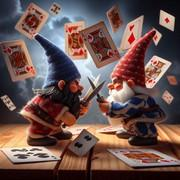

# La Bataille

> Source : [La Bataille](https://jeuxdecartes1.e-monsite.com/pages/jeux-de-bataille/la-bataille.html)

♦ **Matériel** : Un jeu de 52 cartes (sans Joker) duquel on retire un 2 (à 3 joueurs) et deux 2 (à 5 joueurs)

♦ **Nombre de joueurs** : Entre 2 et 5 joueurs

♦ **Objectif** : Avoir en sa possession toutes les cartes du jeu

♦ **Nombre de cartes pour chaque joueur** : 26 cartes (à 2 joueurs), 17 cartes (à 3 joueurs), 13 cartes (à 4 joueurs) et 10 cartes (à 5 joueurs)

♦ **Valeur des cartes, de la plus faible à la plus forte** : 2 – 3 – 4 – 5 – 6 – 7 – 8 – 9 – 10 – Valet – Dame – Roi – As

♦ **Règle du jeu** : Les joueurs ne prennent pas connaissance des cartes qui leur sont distribuées. En même temps, chacun d’eux retourne la carte du haut de son paquet. Celui dont la carte est la plus forte remporte la levée, qu’il place sous son paquet.

En cas d’égalité de valeurs, il y a ***bataille*** : les joueurs concernés s’écrient « ***Bataille !*** » et commencent par placer une première carte face cachée, puis une seconde carte face visible pour décider de qui fera la levée. En cas de nouvelle égalité, la procédure est répétée. La bataille est parfois l'occasion d'acquérir une grosse carte et est l’unique manière de gagner un As. Le gagnant est le joueur ayant en sa possession toutes les cartes du jeu. Un joueur à court de cartes, même lors d’une bataille, est automatiquement éliminé.

---

♦ **Variantes ** :

1) **La Bataille des additions** (à 2 joueurs) : Dans cette variante imaginée par Jesse Weinstein et Nancy Fuller, chaque joueur retourne 2 cartes de son paquet, additionnant leur valeur. Le joueur dont la somme des cartes est la plus grande remporte la levée : les cartes, de l’As au 10, ont leur valeur numérique, et, si on les conserve dans le jeu, le Valet vaut 11 points, la Dame vaut 12 points et le Roi vaut 13 points. S’il y a bataille, trois cartes sont disposées face cachée et deux nouvelles cartes face visible ; le joueur dont la somme des deux dernières cartes est la plus élevée remporte donc les 14 cartes.

2) **La Bataille speed**** **(entre 2 et 5 joueurs) : Dans cette variante inventée par Eric W. Longley, les plus petites cartes sont continuellement retirées du jeu. En début de partie, chaque fois qu’un 2 apparaît, il est écarté du jeu (le joueur remportant une levée avec un 2 perd simplement la carte et empoche la ou les cartes restantes). Une fois que tous les 2 sont supprimés, c’est au tour des 3 d’être écartés du jeu au fur et à mesure qu’ils apparaissent, puis les 4, les 5 et ainsi de suite.

3) **La ******Bataille des clones** **(entre 2 et 4 joueurs) : Cette variante inventée par Ken Scherer se joue avec quatre jeux de 52 cartes desquels on ne conserve que les figures : les Valets, les Dames et les Rois.

Cas particuliers : si tous les joueurs jettent leur dernière carte en même temps lors d’une bataille, le joueur avec la carte finale la plus élevée (face visible ou face cachée) est déclaré gagnant. En cas d’égalité avec les dernières cartes des joueurs jouant à égalité au milieu d’une bataille, la partie se termine sur un match nul.
