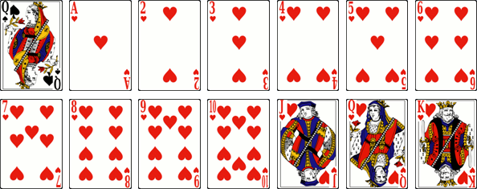

# La Dame de Pique

> Source : [La Dame de Pique](https://jeuxdecartes1.e-monsite.com/pages/jeux-de-levees/la-dame-de-pique.html)

♦ **Matériel** : Un jeu de 52 cartes (sans Joker)

♦ **Nombre de joueurs** : À 4 joueurs

♦ **Objectif** : Totaliser le moins de points à l’issue de chaque manche en évitant les ♥ et la ♠Dame

♦ **Nombre de cartes pour chaque joueur** : 13 cartes

♦ **Valeur des cartes, de la plus faible à la plus forte** : 2 – 3 – 4 – 5 – 6 – 7 – 8 – 9 – 10 – Valet – Dame – Roi – As

♦ **Règle du jeu** : Également connu sous le nom de ***Hearts*** aux États-Unis ou de ***Rickety Kate*** en Australie, ce jeu de cartes aujourd’hui populaire est apparu à la fin du XIXe siècle. Au début de la première manche, chaque joueur choisit trois cartes de sa main et les donne, face cachée, à son voisin de gauche. À la deuxième manche, chaque joueur donne trois cartes à son voisin de droite. À la troisième manche, au joueur assis en face de lui. À la quatrième manche, aucun échange n’est effectué. À partir de la cinquième manche, les échangent reprennent selon le même ordre.

Une fois les cartes distribuées et échangées, le joueur possédant le ♣2 commence en jouant cette carte en entame. Ses adversaires, s’ils le peuvent, répondent à la couleur demandée. Le joueur ayant posé la carte de plus forte valeur dans la couleur demandée remporte la levée et entame le tour suivant. Le jeu se joue dans le sens horaire.

À la fin de chaque manche, les joueurs marquent des points de pénalité pour les cartes qu’ils ont ramassées : la ♠Dame vaut ***13 points*** et chaque ♥ vaut ***1 point***.

La partie continue jusqu’à ce qu’un joueur atteigne ou dépasse les ***100 points***. Celui totalisant le moins de points est déclaré gagnant.

Au premier tour de jeu, il est interdit de se défausser d’un ♥ ou de la ♠Dame. Il est également interdit d’entamer un tour avec un ♥ si aucun ♥ n’a été joué lors d’un tour précédent (à moins, bien sûr, de n’avoir aucune autre couleur dans sa main). C’est pourquoi, on dit familièrement du premier ♥ défaussé qu’il* **brise les cœurs***.

Le Grand Chelem : Si, à la fin d’une manche, un joueur réunit toutes les cartes à points (la ♠Dame et les treize ♥), il ne marque aucun point et ses trois adversaires marquent ***26 points*** chacun.
