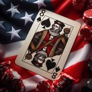

# Last One

> Source : [Last One](https://jeuxdecartes1.e-monsite.com/pages/jeux-d-appariemment/last-one.html)

♦ **Matériel** : Un jeu de 52 cartes et 2 Jokers

♦ **Nombre de joueurs** : Entre 2 et 6 joueurs

♦ **Objectif** : Se débarrasser le premier de toutes ses cartes

♦ **Nombre de cartes pour chaque joueur** : 4 à 9 cartes

♦ **Règle du jeu** : ***Last One*** est une variante du [***8 Américain***](http://jeuxdecartes1.e-monsite.com/pages/jeux-d-appariemment/le-8-americain.html) apparue aux États-Unis dans les années 1970-1980. Le donneur distribue un nombre égal de cartes à chaque joueur, face cachée : de 4 à 8 cartes chacun (au choix du donneur) ou 9 cartes chacun (si tous sont d’accord). Ensuite, la pioche est posée au centre et la première carte est retournée, constituant la défausse. Le joueur à gauche du donneur commence, à moins que la carte retournée ait un effet spécial.

À son tour de jouer, le joueur peut poser :

- Soit une carte de même couleur – ♠, ♣, ♥ ou ♦ – que la carte face visible ;
- Soit une carte de même valeur que la carte face visible ;
- Soit  un 8.

S’il ne peut pas ou ne souhaite pas jouer, il pioche une carte et passe son tour.

Certaines cartes ont un effet lorsqu’on les pose (cartes spéciales) :

| ** Cartes** | ** Pouvoirs** |
|---|---|
| **2** | Le joueur suivant pioche 2 cartes et passe son tour. |
| **3** | Le joueur qui pose cette carte rejoue en posant n’importe quelle carte dessus. |
| **4** | Le joueur qui pose cette carte devient attaquant en provoquant une ***mêlée*** ; le joueur suivant, celui dont c’est le tour, est défenseur. Si ce dernier, ou tout autre joueur, possède le 5 de même couleur, il peut le jouer ; le joueur du 5 devient alors attaquant et l’attaquant précédent devient défenseur. Après le 5, n’importe qui peut jouer le 6 de la même couleur. Et ainsi de suite. Si personne ne joue la carte suivante, le dernier défenseur doit piocher un nombre de cartes égal à la valeur numérique de la carte jouée par le dernier attaquant.

Par exemple : A joue le ♥4 ; B joue le ♥5 ; personne ne joue le ♥6 ; A doit piocher cinq cartes ; le jeu reprend ensuite avec le joueur dont c’est le tour après A. |
| **5**, **6** et **7** | Pas d’effet spécial, sauf dans une mêlée initiée par un 4. |
| **8** | Comme au ***8 Américain***, cette carte peut être jouée sur n’importe quelle carte sans distinction et permet de choisir une autre couleur à jouer. |
| **Valet** | Le joueur suivant passe son tour. |
| **As** | Le sens du jeu change : sens horaire/sens antihoraire. |

Un Joker peut représenter n’importe quelle carte, au choix de celui qui la défausse.

Un joueur qui n’a plus qu’une seule carte en main doit s’écrier « ***Dernière carte !*** ». Si cette dernière formalité est oubliée et qu’un adversaire le remarque, ou suite à toute erreur commise en cours de partie, le joueur en cause doit piocher une carte supplémentaire.

Le jeu se termine dès lors qu’un joueur s’est débarrassé de toutes ses cartes. Les autres marquent des points de pénalité pour chacune des cartes qu’il leur reste. Tout joueur dont les points de pénalité, après plusieurs parties, atteignent ou dépassent un objectif préalablement convenu est éliminé du jeu : on dit qu’il ***fait faillite***. Le dernier joueur en jeu est déclaré gagnant. Quand la pioche est épuisée, on conserve la carte du haut et on mélange le reste, qui devient la nouvelle pioche.

La valeur des cartes :

- **2**, **3**, **4**, **5**, **6**, **7** et **9** : valeur numérique (de 2 à 9 points)
- **10**, **Valet**, **Dame** et **Roi** : 10 points
- **As** : 15 points
- **8** : 25 points
- **Joker** : 40 points
