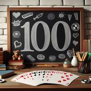

# Le 100

> Source : [Le 100](https://jeuxdecartes1.e-monsite.com/pages/jeux-d-addition/le-100.html)

♦ **Matériel** : Un jeu de 52 cartes (sans Joker) et deux jeux à partir de 7 joueurs, et des jetons

♦ **Nombre de joueurs** : Entre 3 et 10 joueurs

♦ **Objectif** : Rester en jeu en évitant de dépasser 100 points

♦ **Nombre de cartes pour chaque joueur** : 3 cartes

♦ **Règle du jeu** : Le donneur distribue 3 cartes et 3 jetons à chaque joueur et place la pioche au centre, face cachée. Le joueur à sa gauche commence en posant une première carte de sa main à côté de la pioche, fondation de la pile de défausse. Ensuite, à son tour, chaque joueur pose une carte sur la défausse, face visible, énonce la nouvelle valeur de la pile – valeur qu’il affecte en fonction de la carte qu’il joue – et pioche une nouvelle carte pour remplacer celle qu’il vient de jeter.

La valeur de la pile de défausse est initialement à 0 point, et ne peut descendre en dessous de cette valeur. Dès lors qu’un joueur ne peut pas jouer sans dépasser 100 points, il perd un jeton. Un joueur ayant perdu ses 3 jetons abat son jeu sur la table et est éliminé. Le jeu continue jusqu’à ce qu’il ne reste plus qu’un joueur ayant encore au moins un jeton : c’est le gagnant. Si la pioche est épuisée, les cartes jouées – incluant celles des joueurs ayant abandonné – sont mélangées, à l’exception de la dernière, pour constituer une nouvelle pioche.

Le pouvoir des cartes :

- **♠As et ♣As** : le joueur ***choisit la valeur de la pile***, évaluée entre 0 et 100.
- **♠2** : la valeur de la pile ***est doublée.***
- **4** : ***le sens du jeu change : horaire / antihoraire.***
- **♦5 **et **♥5** : la valeur de la pile ***diminue de 5 points.***
- **10** : la valeur de la pile ***s'élève à 100 points.***
- **Valet** : la valeur de la pile ***diminue de 10 points.***
- **♥Dame** : la valeur de la pile ***revient à 0.***
- **Roi** : la valeur de la pile ***reste la même.***

Pour ce qui est des autres cartes, la valeur de la pile augmente en fonction de leur valeur numérique, les Dames comptant 10 points chacune.

Fiche récapitulative : 
