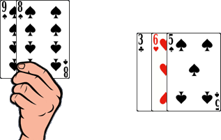

# Le 14

> Source : [Le 14](https://jeuxdecartes1.e-monsite.com/pages/jeux-de-pioche-defausse/le-14.html)

♦ **Matériel** : Deux jeux de 52 cartes (sans Joker)

♦ **Nombre de joueurs** : Entre 2 et 4 joueurs

♦ **Objectif** : Se débarrasser le premier de toutes ses cartes

♦ **Nombre de cartes pour chaque joueur** : 14 cartes, en quatre paquets de 5, 4, 3 et 2 cartes

♦ **Règle du jeu** : Un joueur dispose 14 cartes devant chaque joueur, face cachée, en quatre paquets de 5, 4, 3 et 2 cartes et place ensuite la pioche au centre du jeu, retournant à côté la première carte, qui constitue la défausse. Chaque joueur commence par prendre en main le paquet de 5 cartes, procédant ensuite par paquets de cartes dans l’ordre décroissant. À son tour de jouer, dans l’ordre :

1) Le joueur prend une carte, soit dans la pioche, soit dans la défausse.

Néanmoins, ***si toutes les cartes de sa main peuvent être posées en un seul coup***, le joueur ne pioche aucune carte ; c’est au tour du joueur suivant.

2) Avec son jeu, il s’évertue à faire des combinaisons de cartes – d’au moins 2 cartes – dont la somme vaut 14, condition indispensable pour les poser sur la table, à la vue des autres joueurs. Les cartes, de l’As au 10, ont leur valeur numérique, le Valet vaut 11 points, la Dame vaut 12 points et le Roi vaut 13 points.

3) Autant de fois qu’il le peut ou le souhaite :

- Le joueur peut substituer une carte de son jeu contre deux cartes d’une combinaison d’au moins 3 cartes et dont la somme équivaut à la valeur de cette carte, par exemple :

Le joueur remplace son 8 par le 5 et le 3 :

Avec le 5 et le 9, le joueur forme une nouvelle combinaison. Il jette sa dernière carte :

- Le joueur peut, inversement, substituer deux cartes de son jeu contre une carte d’une combinaison.
- Le joueur peut, enfin, substituer deux cartes d’une combinaison avec une carte d’une autre combinaison.

4) Enfin, il jette une carte de son choix, sinon la dernière de sa main (auquel cas, il prend connaissance du paquet suivant disposé devant lui) dans la défausse. C’est au tour du joueur suivant. Dès qu’un joueur a épuisé ses 14 cartes, c’est-à-dire qu’il a vidé son dernier paquet, il a gagné, le jeu se termine.
