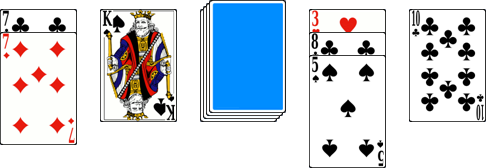

# Le 21

> Source : [Le 21](https://jeuxdecartes1.e-monsite.com/pages/jeux-d-addition/le-21.html)

♦ **Matériel** : Un jeu de 52 cartes (sans Joker)

♦ **Nombre de joueurs** : Entre 2 et 8 joueurs

♦ **Objectif** : Combiner les cartes pour accumuler le maximum de combinaisons de 21 points

♦ **Nombre de cartes pour chaque joueur** : 1 carte

♦ **Règle du jeu** : Le ***21*** (ou ***Stack Cards***), variante simplifiée du ***Blackjack***, est une adaptation à plusieurs joueurs et sous la forme d’un jeu coopératif d’un jeu en ligne du même nom. Après que chaque joueur a reçu sa carte, la pioche est disposée, face cachée, au centre du jeu. À son tour de jeu, le joueur doit positionner sa carte sur l’une des quatre piles afin de constituer des combinaisons de ***21 points*** (de 2, 3, 4 ou 5 cartes), l’objectif étant d’en faire le maximum au cours de la partie :

S’il ne souhaite pas jouer sa carte, le joueur la retourne et l’écarte du jeu (après avoir pris soin de la montrer à ses coéquipiers) ; la carte ne pourra plus être utilisée pendant la partie. Après quoi, il pioche une nouvelle carte ; c’est au tour du joueur suivant. Lorsqu’une combinaison de ***21 points*** est effectuée, les cartes qui la composent sont écartées du jeu et seront comptabilisées à l’issue de la partie ; une pile se libère. En revanche, si la combinaison dépasse 21 points, les cartes écartées sont retournées et ne seront pas comptabilisées. Les cartes, du 2 au 10, ont leur valeur numérique, les figures valent 10 points, et l’As, 1 ou 11 points.

À l’issue de la partie, les joueurs effectuent le comptage des points :

- Une combinaison de 3 cartes rapporte ***3 points***.
- Une combinaison de 4 cartes rapporte ***4*** ***points***.
- Une combinaison de 5 cartes rapporte ***5 points***.
- Une combinaison de 2 cartes rapporte ***10 points***.
- La combinaison ***As + Blackjack (Valet noir)*** rapporte ***15*** ***points***.
- La combinaison ***7 + 7 + 7*** rapporte ***20 points***.

Le défi des joueurs est de totaliser le plus de points à l’issue de la partie.
