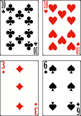

# Le 24

> Source : [Le 24](https://jeuxdecartes1.e-monsite.com/pages/jeux-d-addition/le-24.html)

♦ **Matériel** : Un jeu de 52 cartes (sans Joker) duquel on retire les Rois, les Dames et les Valets

♦ **Nombre de joueurs** : À 2 joueurs (jusqu’à 8 joueurs dans la variante)

♦ **Objectif** : Résoudre des opérations pour se débarrasser le premier de toutes ses cartes

♦ **Nombre de cartes pour chaque joueur** : 20 cartes

♦ **Règle du jeu** : Le ***24*** est un jeu de calcul mental d’origine chinoise. Les cartes forment un paquet de 20 cartes, face cachée, devant chaque joueur. En même temps, chacun retourne les 2 cartes du haut de son paquet et les place devant soi, face visible, formant un carré de 4 cartes sur la table. L’objectif est d’obtenir ***24*** en combinant entre eux ***l’ensemble des 4 nombres ***et en utilisant exclusivement l’addition, la soustraction, la multiplication et la division.

Voici un exemple :

Les joueurs doivent tenter d’obtenir 24 en combinant les quatre nombres suivants : 10, 10, 3 et 6. Une solution possible : 6 x (10 / 10 + 3) = 24.

1) Le premier joueur à trouver le résultat illustre sa solution à son adversaire :

- Si c’est juste, les 4 cartes sont données à l’autre joueur, qui les place sous son paquet ;
- Si c’est faux, il prend lui-même les 4 cartes, les plaçant sous son paquet.

2) Si aucun joueur ne trouve de solution au bout d’un moment – aucune solution n’est parfois possible –, tous deux conviennent de remplacer une de leurs cartes, qu’il place sous leur paquet, par celle du haut de leur paquet.

De nouveau, chaque joueur s’évertue à faire 24, ce processus étant répété jusqu’à ce qu’un joueur n’ait plus de cartes en main : c’est le gagnant. À noter : les joueurs peuvent mélanger ou couper leur paquet de cartes quand ils le souhaitent.

---

♦ **Variante (entre 2 et 8 joueurs)** : Du paquet de 40 cartes, le donneur en tire 4 et les dispose, face visible, sur la table. Soit un joueur trouve un moyen de faire 24 avec les quatre nombres, soit tous conviennent qu’aucune solution n’est possible. Enfin, les cartes sont remises dans le paquet, que le donneur mélange avant chaque nouvelle pioche.

Si l’on souhaite conserver le calcul des points, il est d’usage que le premier joueur à trouver une solution marque ***1 point***. Si aucune solution ne peut être trouvée, le premier à s’écrier *« **Pas de solution !*** » marque également ***1 point***. Néanmoins, si un autre joueur trouve une solution après que « ***Pas de solution !*** » a été déclaré, le joueur qui s’est trompé ne marque aucun point et celui ayant résolu l’opération gagne ***2 points***.
