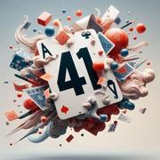

# Le 41

> Source : [Le 41](https://jeuxdecartes1.e-monsite.com/pages/jeux-de-pioche-defausse/le-41.html)

♦ **Matériel** : Un jeu de 52 cartes (sans Joker)

♦ **Nombre de joueurs** : Entre 2 et 6 joueurs

♦ **Objectif** : Recueillir 4 cartes d’une même couleur et totaliser le maximum de points

♦ **Nombre de cartes pour chaque joueur** : 4 cartes

♦ **Règle du jeu** : Le ***41***, aussi appelé ***Empat Satu***, est un jeu indonésien. Un joueur distribue 4 cartes à chaque joueur, face cachée, et pose la pioche au centre. À son tour de jouer, chaque joueur doit prendre une carte, de la pioche ou de la défausse, et en jeter une. Toutefois, au début de chaque partie, il est contraint de piocher (puisqu’aucune carte n’a encore été jetée). Le jeu se joue dans le sens horaire.

Dès lors qu’un joueur recueille dans sa main ***4 cartes de même couleur*** après avoir pioché et s’être défaussé d’une carte, il peut arrêter la partie au début de son prochain tour de jeu. Si aucun joueur n’a arrêté la partie, celle-ci prend fin lorsqu’il n’y a plus de cartes dans la pioche et qu’un joueur ne souhaite pas prendre la carte de la défausse. Les joueurs montrent alors leurs cartes et procèdent au décompte des points.

La valeur d’une main de 4 cartes est calculée en additionnant la valeur des cartes d’une même couleur (couleur dominante) et en soustrayant la valeur des cartes des autres couleurs. Ainsi, avec la main ♥As - ♥7 - ♥2 - ♣5, le joueur comptabilise 11 + 7 + 2 – 5 = 15 points. La main la plus forte, telle ♦As - ♦Roi - ♦Dame - ♦10, totalise ***41 points***. Un total de points négatif est possible : avec la main ♣7 - ♥9 - ♦2 - ♦10, le joueur marque 10 + 2 – 9 – 7 = - 4 points.

La valeur des cartes :

- ** 2**, **3**, **4**, **5**, **6**, **7**, **8**, **9** et **10** : valeur numérique (de 2 à 10 points)
- ** Valet**, **Dame **et **Roi **: 10 points
- ** As **: 11 points

Le joueur ayant la main de plus grande valeur est le gagnant, celui ayant la main de plus faible valeur est le perdant. En cas d’égalité, la plus mauvaise carte départage : ainsi, la main ♥Valet - ♥9 - ♥8 - ♥5 bat la main ♥As - ♥Roi - ♥7 - ♥4, chacune pourtant valant 32 points, car le ♥5 a une valeur supérieure au ♥4. De même, la main ♥Valet - ♥10 - ♥7 - ♣4 bat la main ♥As - ♥Roi - ♥8 - ♣6, chacune s’équivalant, car le ♣4, dans le cas d’une valeur négative, vaut davantage que le ♣6. Aucun score n’est conservé d’une manche à l’autre : le perdant devient le prochain donneur et le gagnant, le premier à jouer.
