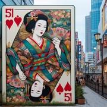

# Le 51 Japonais

> Source : [Le 51 Japonais](https://jeuxdecartes1.e-monsite.com/pages/jeux-de-commerce/le-51-japonais.html)

♦ **Matériel** : Un jeu de 52 cartes (sans Joker)

♦ **Nombre de joueurs** : Entre 2 et 6 joueurs

♦ **Objectif** : Collecter 5 cartes d’une même couleur

♦ **Nombre de cartes pour chaque joueur** : 5 cartes

♦ **Règle du jeu** : Le ***51 Japonais***, connu sous le nom de ***Goju Ichi*** au Japon, est un jeu enfantin apparenté au ***51 Chinois***. Un joueur distribue 5 cartes à chaque joueur, une par une, retourne les 5 cartes suivantes, qu’il dispose au centre du jeu, et pose la pioche sur la table, face cachée.

À son tour de jouer, le joueur ramasse l’une des cinq cartes posées sur la table et se défausse d’une autre carte, conservant toujours cinq cartes en main. Après le premier tour de jeu, une autre option devient possible : s’il n’est pas intéressé par les cartes posées sur la table, il peut les mettre de côté et en piocher cinq nouvelles ; l’échange se fait donc avec l’une de ces cinq nouvelles cartes. Si la pioche est épuisée, les cartes mises de côté sont mélangées pour former une nouvelle pioche.

À la fin de son tour de jeu, c’est-à-dire après avoir jeté sa carte, un joueur peut s’écrier « ***Stop !*** » s’il pense posséder une meilleure main que ses adversaires. Un dernier tour s’engage alors entre les joueurs, excluant l’annonceur, et la partie se termine.

La valeur d’une main de 5 cartes est calculée en additionnant la valeur des cartes d’une même couleur (couleur dominante) et en soustrayant la valeur des cartes des autres couleurs. Ainsi, avec la main ♥As - ♥8 - ♥3 - ♣5 - ♦2, le joueur a 11 + 8 + 3 – 5 – 2 = 15 points. La main la plus forte est la suite As - Roi - Dame - Valet - 10 dans une même couleur, équivalent de la ***quinte floche royale ***au poker ; elle vaut ***51 points***. Un total de points négatif est également possible : avec la main ♥Roi - ♥5 - ♥2 - ♣10 - ♦10, le joueur totalise 10 + 5 + 2 – 10 – 10 = - 3 points.

La valeur des cartes :

- **2, 3, 4, 5, 6, 7, 8, 9 **et** 10 **: valeur numérique (de 2 à 10 points)
- **Valet, Dame **et **Roi** : 10 points
- **As** : 11 points

Le joueur avec la main de plus grande valeur est le gagnant ; en cas d’égalité avec l’annonceur, le gagnant est toujours l’autre joueur. En revanche, en cas d’égalité entre plusieurs joueurs autres que l’annonceur, tous sont déclarés gagnants.
