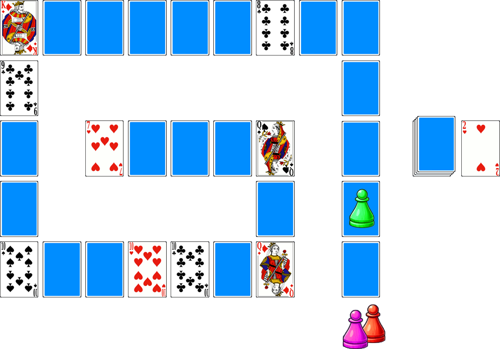

# Le 7 de Cœur

> Source : [Le 7 de Cœur](https://jeuxdecartes1.e-monsite.com/pages/jeux-de-course/le-7-de-coeur.html)

♦ **Matériel** : Un jeu de 52 cartes et 2 Jokers, ainsi que des pions

♦ **Nombre de joueurs** : Entre 2 et 6 joueurs

♦ **Objectif** : Être le premier joueur à terminer sa course

♦ **Règle du jeu** : Le ***7 de Cœur ***est un jeu de course semblable au célèbre ***Jeu de l’Oie***. D’un jeu de 52 cartes, on regroupe en un paquet les As, les 2, les 3, les 4, les 5, les 6 et un Joker. Les autres cartes constituent le plateau de jeu ; leur disposition est la suivante :

Chaque joueur choisit un pion, qu’il place avant la première carte. À son tour de jouer, il retourne la première carte du paquet et avance son pion d’autant de cartes que l’indique la carte retournée ; dans l’exemple, le ♥2 fait avancer le pion vert du premier joueur de deux cartes. Le premier joueur dont le pion arrive précisément sur le ♥7 gagne la partie.

Pour aider ou handicaper les joueurs, voici les règles à respecter :

- Un joueur arrivant sur le ♣8, le ♣9 et le ♣10 avance de nouveau d’autant de cartes ;
- Un joueur échouant sur la ♦Roi doit passer son prochain tour de jeu ;
- Un joueur arrivant sur la ♦Dame retourne sur le ♦Roi, où il devra passer son prochain tour de jeu ;
- Un joueur tombant sur le ♠10 doit attendre qu’un autre joueur le libère, ou bien en le rejoignant sur cette carte, ou bien en s’arrêtant sur le ♥10 ;
- Un joueur arrivant sur le ♥10 libère le joueur en prison (♠10), s’il y en a un ;
- Un joueur arrivant sur la ♠Dame retourne au début ;
- Un joueur arrivant sur le ♥7 gagne la partie ; s’il fait un nombre supérieur au nombre de cartes le séparant de la victoire, il doit reculer d’autant de cartes supplémentaires ;
- Celui qui est rejoint par un autre joueur sur la même carte devra se rendre sur la carte où l’autre joueur se situait avant de jouer ;
- Lorsqu’un joueur retourne un Joker, il peut, s’il le souhaite, échanger son pion avec celui du joueur de son choix.

Quand la pioche est épuisée, elle est mélangée et reconstituée.
