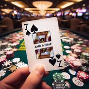

# Le 7½

> Source : [Le 7½](https://jeuxdecartes1.e-monsite.com/pages/jeux-de-banque/le-7-et-demi.html)

♦ **Matériel** : Un jeu de 52 cartes (sans Joker) duquel on retire les 8, les 9 et les 10, et des jetons ou faux billets pour les paris

♦ **Nombre de joueurs** : Entre 2 et 12 joueurs

♦ **Objectif** : Obtenir 7½ (7 et demi) ou s’en approcher le plus possible

♦ **Nombre de cartes pour chaque joueur** : 1 carte face cachée (en début de partie)

♦ **Règle du jeu** :  Appelé ***Sette e Mezzo*** en Italie, d’où il est originaire, ce jeu de casino connaît pas mal de variantes, en Espagne et au Brésil notamment. En début de partie, les joueurs nomment, ou tirent au sort, un banquier et décident des paris minimum et maximum autorisés. Pendant que les joueurs déposent leur mise devant eux, le banquier mélange les cartes et en donne une à chacun, face cachée, dans le sens inverse des aiguilles d’une montre, achevant le tour par lui-même.

Ensuite, chaque joueur, en commençant par celui situé à droite du banquier, prend connaissance de sa carte face cachée, en faisant bien attention de ne pas la révéler aux autres ; deux possibilités s’offrent à lui :

1) Il passe son tour (s’il est satisfait de son total de points).

2) Il demande une carte au banquier pour augmenter son total de points, carte qui lui sera distribuée face visible :

- Si son total est ***supérieur à 7½***, il montre toutes ses cartes et perd sa mise.
- Si son total est ***exactement de 7½***, il montre toutes ses cartes et arrête de jouer. Il gagne, à moins que le banquier n’obtienne, lui aussi, un total de 7½.
- Si son total est** *****inférieur à 7½***, il peut de nouveau choisir de passer son tour ou demander une nouvelle carte au banquier. En effet, tant que son total reste inférieur à 7½, il peut demander autant de cartes qu’il le souhaite.

Une fois que tous les joueurs ont joué, le banquier retourne sa carte et, comme l’ont fait les autres joueurs, choisit de s’ajouter ou non une ou plusieurs cartes supplémentaires. Il peut voir les cartes exposées de chacun des autres joueurs, mais pas leur carte face cachée.

- Si le banquier fait un total ***supérieur à 7½***, il perd face à tous les joueurs qui ne sont pas éliminés, et se voit contraint de doubler la mise de chacun d’eux (chaque joueur encore en jeu récupère donc sa mise plus un montant équivalent).
- Si le banquier fait un total ***inférieur ou égal à 7******½***, il gagne les mises de tous les joueurs ayant un total inférieur ou égal au sien (en plus des mises des joueurs éliminés, qu’il a déjà collectées) et perd celles des joueurs ayant un total plus élevé, qu’il double.

Enfin, si un seul joueur fait un total d’exactement 7½, ce joueur non seulement gagne mais prend également le contrôle de la banque et distribue pour la partie suivante. Si plus d’un joueur, excepté le banquier, fait un total de 7½, la banque est prise en charge par le premier de ces joueurs dans le sens inverse des aiguilles d’une montre en commençant par le banquier.

Les cartes, de l’As au 7, comptent pour leur valeur numérique et les figures valent 0,5 chacune.
