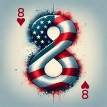

# Le 8 Américain

> Source : [Le 8 Américain](https://jeuxdecartes1.e-monsite.com/pages/jeux-d-appariemment/le-8-americain.html)

♦ **Matériel** : Deux jeux de 52 cartes (sans Joker)

♦ **Nombre de joueurs** : Entre 2 et 10 joueurs

♦ **Objectif** : Se débarrasser le premier de toutes ses cartes

♦ **Nombre de cartes pour chaque joueur** : 7 cartes

♦ **Règle du jeu** : Le ***8 Américain*** serait apparu dans les années 1930 aux États-Unis, pays dans lequel il est connu aujourd’hui sous le nom de ***Crazy Eights*** ; le ***UNO***, joué avec des cartes spécifiques, en est une célèbre adaptation. Ce jeu comportant d’innombrables variantes, la version présentée ici est l’une des plus plaisantes à jouer. Le donneur distribue 7 cartes à chaque joueur, face cachée, pose la pioche au centre et retourne à côté la première carte, fondement de la pile de défausse – si c’est une carte spéciale, elle est replacée sous la pioche. À son tour, le joueur peut poser :

- Soit une carte de même couleur – ♠, ♣, ♥ ou ♦ – que la carte face visible ;
- Soit une carte de même valeur que la carte face visible ;
- Soit un 8.

Lorsqu’un joueur ne peut pas ou ne souhaite pas poser une carte de sa main, il pioche : si cette carte peut être jouée, il peut la jouer ; si ce n’est pas le cas, il la garde dans son jeu, et c’est au tour du joueur suivant.

Certaines cartes ont un effet lorsqu’on les pose (cartes spéciales) :

| **Cartes** | **Pouvoirs** |
|---|---|
| **As** | Le joueur suivant doit poser un As ou un 8, sous peine de piocher 2 cartes. S’il pose un As, le joueur suivant doit alors piocher 4 cartes... et ainsi de suite. Le 8 annule le cumul des As. |
| **2** | Le joueur suivant pioche 2 cartes et passe son tour. |
| **♠4** | Le joueur suivant pioche 4 cartes et passe son tour. |
| **7** | Le joueur suivant passe son tour. |
| **8** | Comme un Joker, cette carte peut être posée sur n’importe quelle autre carte sans distinction et permet de choisir la prochaine couleur à jouer. |
| **10** | Le joueur qui joue cette carte rejoue. S’il ne peut pas, il est contraint de piocher, même s’il n’a plus de carte en main. |
| **Valet** | Le sens du jeu change : sens horaire/sens antihoraire. |
| **♥Roi** | Le joueur peut, s’il le souhaite, échanger sa main avec le joueur de son choix (sauf avec un joueur en situation de « ***Carte !*** »). |

Remarques : Traditionnellement, il est courant de commencer à jouer avec peu de cartes spéciales – seulement le 8, au début – et d’ajouter, partie après partie, des pouvoirs supplémentaires. À 2 joueurs, toutefois, le 7 et le Valet perdent leur effet.

Lorsqu’il ne reste plus qu’une carte dans la main d’un joueur, ce dernier doit s’exclamer « ***Carte !*** ». Si cette dernière formalité est oubliée et qu’un adversaire s’écrie « ***Contre-carte !*** », ou suite à toute erreur commise en cours de partie, le joueur en cause doit piocher deux nouvelles cartes. Quand la pioche est épuisée, on conserve la carte du haut et on mélange le reste, qui devient la nouvelle pioche. Le gagnant est le premier joueur à s’être débarrassé de toutes ses cartes.

---

♦ **Variantes** :

1) Dans certaines variantes :

- Lorsqu'un joueur ne peut pas jouer, il pioche une carte et passe son tour ou pioche jusqu’à ce qu’il puisse jouer ;
- Le joueur qui pose un 8 doit choisir une couleur qu’il a dans sa main ;
- Finir avec un 8 est interdit ;
- Un joueur qui pose un 4 doit dire « Quatre ! » ; s’il oublie et qu’un adversaire s’écrie « Contre-quatre ! », le joueur concerné doit piocher deux nouvelles cartes.

2) David Parlett décrit le ***8 Américain ***« *non comme un jeu mais **comme un modèle de jeu de base sur lequel une grande variété de changements peuvent être apportés* ». Les joueurs peuvent donc, à leur gré, imaginer de nouvelles règles à partir du modèle de base.

3) [***Last One***](http://jeuxdecartes1.e-monsite.com/pages/jeux-d-appariemment/last-one.html) est une variante sympathique du ***8 Américain***.
