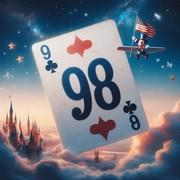

# Le 98 (var.)

> Source : [Le 98 (var.)](https://jeuxdecartes1.e-monsite.com/pages/jeux-d-addition/le-98-var-.html)

♦ **Matériel** : Un jeu de 52 cartes (sans Joker)

♦ **Nombre de joueurs** : Entre 2 et 6 joueurs

♦ **Objectif** : Ne pas dépasser 98 points

♦ **Nombre de cartes pour chaque joueur** : 4 cartes

♦ **Règle du jeu** : Dans cette variante du[ ***98***](http://jeuxdecartes1.e-monsite.com/pages/jeux-d-addition/le-98.html) jouée à l’université du Massachusetts à Amherst, les cartes spéciales sont les suivantes :

- **♣As **et ♦**As** : la valeur de la pile ***augmente de 1 ou 11 points ***(au choix du joueur).
- **♠As** : le joueur ***choisit d’éliminer un autre joueur*** pour la partie en cours.
- ♥**As** : la valeur de la pile ***reste la même***. Joué sur l’**♠As**, il empêche au joueur désigné d’être éliminé, mais celui-ci ne doit pas oublier de piocher immédiatement une nouvelle carte.
- **4** : ***le sens du jeu change : horaire/antihoraire***.
- **9** : la valeur de la pile ***reste la même***.
- **10** : la valeur de la pile ***augmente ou*** ***diminue de 10 points ***(au choix du joueur).
- **♠Dame **: le joueur ***échange son jeu*** avec celui du joueur de son choix.
- **Roi** : la valeur de la pile ***s’élève à 98 points***.

Pour ce qui est des autres cartes, la valeur de la pile augmente en fonction de leur valeur numérique, les Valets et les Dames (hormis la ***♠****Dame***) comptant 10 points chacun.
