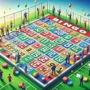

# Le Bingo

> Source : [Le Bingo](https://jeuxdecartes1.e-monsite.com/pages/jeux-de-banque/le-bingo.html)

♦ **Matériel** : Deux jeux de 52 cartes (sans Joker)

♦ **Nombre de joueurs** : Entre 2 et 11 joueurs

♦ **Objectif** : Être le premier joueur à retourner toutes ses cartes

♦ **Nombre de cartes pour chaque joueur** : 5 cartes

♦ **Règle du jeu** : À la base, le ***Bingo*** est un jeu de loterie dans lequel il faut remplir une grille de nombres. Pour jouer à l’adaptation en cartes traditionnelles de ce célèbre jeu de hasard, cinq cartes issues d’un premier jeu de 52 cartes doivent être distribuées à chaque joueur, alignées face visible devant lui.

Après quoi, un joueur désigné comme étant ***l’appelant***, qui peut ou non jouer avec les autres joueurs (à 2 joueurs toutefois, il est obligé de jouer), pioche une à une les cartes dans l’autre jeu de 52 cartes en annonçant leur valeur et leur couleur. Le cas échéant, chaque carte appelée doit être retournée face cachée par le joueur qui la possède. Le premier joueur à retourner toutes ses cartes s’écrie « ***Bingo !*** » et remporte la partie.

---

♦ **Variante (sans couleurs)** : Une variante propose de ne prendre en compte que la valeur des cartes appelées, sans considération de leur couleur. Ainsi, les joueurs doivent retourner ***toutes*** les cartes de la valeur annoncée qu’ils possèdent. Il est donc possible que plusieurs joueurs gagnent en même temps ; si l’on veut néanmoins les départager, le gagnant peut être le premier à s’être écrié « ***Bingo !*** ».
