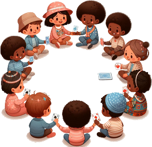

# Le Coucou

> Source : [Le Coucou](https://jeuxdecartes1.e-monsite.com/pages/jeux-de-passes-de-cartes/le-coucou.html)

♦ **Matériel** : Un jeu de 52 cartes (sans Joker) et des jetons

♦ **Nombre de joueurs** : Entre 5 et 20 joueurs

♦ **Objectif** : Rester en jeu en se débarrassant stratégiquement des cartes de faible valeur

♦ **Nombre de cartes pour chaque joueur** : 1 carte et des jetons

♦ **Valeur des cartes, de la plus faible à la plus forte** : As – 2 – 3 – 4 – 5 – 6 – 7 – 8 – 9 – 10 – Valet – Dame – Roi

♦ **Règle du jeu** : Le ***Coucou*** est un jeu de cartes français dont les origines remonteraient au début du XVIe siècle. En début de partie, chacun reçoit un nombre égal de jetons, généralement entre 2 et 5. Ensuite, le donneur distribue une carte à chaque joueur et trois cartes à lui-même, en commençant par le joueur à sa droite et en continuant dans le sens antihoraire. La pioche, constituée des cartes restantes, est disposée devant lui, face cachée. Parmi ses trois cartes, celui-ci conserve celle de plus grande valeur et remet les deux autres sous la pioche, face cachée. Une fois que chacun a pris connaissance de sa carte, le joueur situé à sa droite commence ; deux possibilités s’offrent à lui :

1) S’il souhaite garder sa carte, il s’écrie « ***Je garde !*** ». Le tour passe au joueur suivant.

2) S’il souhaite échanger sa carte avec son voisin de droite, il s’écrie « ***Je change !*** ». Ce dernier ne peut refuser la transaction, sauf s’il possède un Roi. Dans ce cas, il lance un « ***Coucou !*** » au demandeur, qui se voit alors contraint de conserver sa carte.

S’il le souhaite, le dernier joueur à jouer peut échanger sa carte avec celle du dessus de la pioche, mais pas avec le donneur. En revanche, s’il s’agit d’un Roi, la transaction est refusée.

Une fois les échanges terminés, les cartes sont révélées : le ou les joueurs avec la carte de plus faible valeur perdent un jeton. En revanche, si tous les joueurs ont une carte de même valeur, aucun jeton n’est perdu. Pour le tour suivant, le donneur est le joueur situé à droite du précédent donneur. Lorsqu’un joueur n’a plus de jetons, il est éliminé. Le gagnant est donc le dernier joueur encore en jeu.

---

♦ **Variante** : Dans l’***As qui Court***, variante du jeu, le donneur joue en dernier ; il ne prend donc qu’une seule carte, qu’il pourra échanger avec celle du dessus de la pioche (à moins, bien sûr, qu’il ne s’agisse d’un Roi). En conséquence, le joueur à sa gauche, à son tour, peut échanger sa carte avec lui. Enfin, un joueur qui, possédant un Roi, refuse un échange, abat sa carte sans rien dire.
