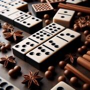

# Le Domino

> Source : [Le Domino](https://jeuxdecartes1.e-monsite.com/pages/jeux-d-appariemment/le-domino.html)

♦ **Matériel** : Un jeu de 52 cartes (sans Joker)

♦ **Nombre de joueurs** : Entre 3 et 8 joueurs

♦ **Objectif** : Se débarrasser le premier de toutes ses cartes

♦ **Nombre de cartes pour chaque joueur** : Toutes les cartes sont distribuées équitablement, une différence d’une carte étant possible entre les joueurs

♦ **Valeur des cartes, de la plus faible à la plus forte** : As – 2 – 3 – 4 – 5 – 6 – 7 – 8 – 9 – 10 – Valet – Dame – Roi

♦ **Règle du jeu** : Le ***Domino***, aussi connu sous le nom de ***Fan Tan***, est un jeu de cartes enfantin dans lequel les joueurs doivent reconstituer une grille de quatre suites, de l’As au Roi, dans chaque couleur (♠, ♣, ♥ et ♦), en commençant par les 7 (au milieu). Un joueur mélange le paquet, le donne à couper au joueur à sa droite et distribue, une à une, l’ensemble des 52 cartes. En commençant par le joueur à la gauche du donneur, et dans le sens horaire, chacun a la possibilité :

1) De poser un 7 pour entamer une nouvelle suite.

2) Ou de compléter une suite, en posant par exemple le ♠6 à gauche du ♠7 ou le ♠8 à sa droite. Les joueurs peuvent placer les cartes côte à côte (et former une grille) ou opter pour une disposition plus compacte dans laquelle les cartes hautes sont empilées sur les 8 et les cartes basses sur les 6.

S’il ne peut pas jouer – et seulement dans ce cas –, le joueur passe son tour. Le gagnant est le premier joueur n’ayant plus de cartes en main.

---

♦** ****Variante** : Dans certaines versions, c’est le joueur ayant en sa possession le ♦7 qui commence (en jouant le ♦7 comme première carte).
