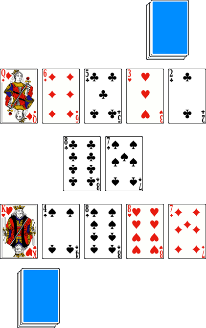

# Le Flip

> Source : [Le Flip](https://jeuxdecartes1.e-monsite.com/pages/jeux-d-appariemment/le-flip.html)

♦ **Matériel** : Un jeu de 52 cartes (sans Joker)

♦ **Nombre de joueurs** : À 2 joueurs

♦ **Objectif** : Se débarrasser le premier de toutes ses cartes

♦ **Nombre de cartes pour chaque joueur** : 26 cartes

♦ **Règle du jeu** : Dans ce jeu de rapidité, également connu sous le nom de ***Speed***, les joueurs retournent la première carte de leur paquet et la posent au centre de la table, constituant la base des deux piles de défausse. Au signal, chacun retourne rapidement devant lui les cinq premières cartes de son paquet et tente de les défausser sur les deux piles centrales :

La règle de défausse est simple : une carte doit avoir une différence de « 1 » avec la première carte visible de la défausse. Ainsi, un 9 peut être posé sur un 8 ou sur un 10 ; on considère que l’As suit le Roi et précède le 2. Pour chaque carte défaussée, le joueur peut retourner une nouvelle carte de son paquet, de manière à toujours garder, au maximum, cinq cartes étalées en face de lui, sur la table.

Les joueurs jouent en même temps. Si les deux possèdent une carte qui peut aller sur la même pile de défausse, seul le plus rapide peut la poser. Lorsque les joueurs conviennent qu’aucune pose n’est plus possible, chacun retourne en même temps la première carte de son paquet pour constituer deux nouvelles entames sur les piles de défausse. Le gagnant est le premier joueur à s’être débarrassé de toutes ses cartes.

---

♦** ****Variante** : Pour un jeu en plusieurs manches, on convient que le gagnant de chaque manche marque un point pour chaque carte restant dans le jeu de son adversaire. Le premier joueur à atteindre ou dépasser un total de points convenu (par exemple ***25 points***) remporte la partie.
