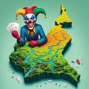

# Le Générala

> Source : [Le Générala](https://jeuxdecartes1.e-monsite.com/pages/jeux-de-levees/le-generala.html)

♦ **Matériel** : Un jeu de 52 cartes et 2 Jokers

♦ **Nombre de joueurs** : Entre 2 et 10 joueurs

♦ **Objectif** : Se débarrasser le plus vite de toutes ses cartes

♦ **Nombre de cartes pour chaque joueur** : Toutes les cartes sont distribuées équitablement, une différence d’une carte étant possible entre les joueurs

♦ **Valeur des cartes, de la plus faible à la plus forte** : 2 – 3 – 4 – 5 – 6 – 7 – 8 – 9 – 10 – Valet – Dame – Roi – As – Joker

♦ **Règle du jeu** : Le ***Générala*** est un jeu camerounais. D’abord, le donneur distribue les cartes une par une, dans le sens antihoraire. Ensuite, un joueur pose une première carte face visible. Enfin, les autres joueurs, chacun leur tour, et toujours dans le sens antihoraire, répondent à la couleur demandée, mais sans nécessité de vaincre la carte ou les cartes déjà posées. Celui ayant posé la carte la plus forte ramasse la levée et entame le tour suivant. S’il ne peut pas répondre à la couleur demandée :

1) Le joueur peut poser un Joker (carte la plus forte), les joueurs suivants continuant de répondre à la couleur de la première carte. Si les deux Jokers ont été joués, le joueur ayant posé le premier remporte la levée.

2) Si le joueur n’a pas de Joker, ou ne souhaite pas en poser un, il ne joue pas et met fin au tour de jeu. Il prend dans sa main l’une des cartes jouées, au choix, hormis un Joker. Les cartes restantes sont retournées, face cachée, et celui ayant joué la carte la plus forte enchaîne avec une autre carte pour le tour suivant.

Remarque : Si un joueur entame le tour avec un Joker, ses adversaires peuvent jouer toutes les cartes qu’ils souhaitent, le Joker étant nécessairement la carte la plus forte.

Si le joueur ayant joué la carte de plus grande valeur se retrouve à court de cartes, le tour suivant est entamé par celui ayant joué la carte la plus forte, quelle que soit sa couleur, parmi les joueurs ayant encore au moins une carte en main. S’ils sont plusieurs à se partager la carte la plus forte, le joueur le plus proche du précédent meneur, en partant par la droite, entame le tour suivant.

Dès lors qu’un joueur n’a plus de cartes en main, il est sauvé et sort du jeu ; les autres continuent à jouer jusqu’à ce qu’il ne reste plus qu’un seul joueur. Ce dernier est éliminé et distribue les cartes pour la prochaine manche, à laquelle il ne participe pas ; le nombre de joueurs diminue donc au fur et à mesure. Si tous les joueurs encore en jeu posent leur dernière carte au cours du même tour, il n’y a aucun perdant (tout le monde reste donc pour la manche suivante). Le gagnant est ***le dernier joueur restant en jeu*** une fois que tous les autres ont été éliminés, manche après manche. À 2 joueurs, le jeu est individuel : il y a un gagnant et un perdant à l’issue de chaque partie.
