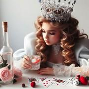

# Le Gin Rami

> Source : [Le Gin Rami](https://jeuxdecartes1.e-monsite.com/pages/jeux-de-pioche-defausse/le-gin-rami.html)

♦ **Matériel** : Un jeu de 52 cartes (sans Joker)

♦ **Nombre de joueurs** : À 2 joueurs

♦ **Objectif** : Totaliser moins de points que son adversaire

♦ **Nombre de cartes pour chaque joueur** : 10 cartes

♦ **Valeur des cartes, de la plus faible à la plus forte** : As – 2 – 3 – 4 – 5 – 6 – 7 – 8 – 9 – 10 – Valet – Dame – Roi

♦ **Règle du jeu** : Un joueur distribue 10 cartes à chacun des joueurs, face cachée, pose la pioche au centre et retourne à côté la vingt-et-unième carte, qui constitue l’entame, première carte de la défausse. Le joueur n’ayant pas distribué choisit de prendre ou de laisser l’entame à l’autre joueur. Si ce dernier la refuse aussi, le premier joueur prend la première carte de la pioche et commence la partie. Par la suite, à son tour de jouer, chaque joueur doit toujours prendre une carte, de la pioche ou de la défausse, et en jeter une.

Comme au [***Rami***](http://jeuxdecartes1.e-monsite.com/pages/jeux-de-pioche-defausse/le-rami.html), l’objectif du ***Gin Rami ***est de constituer des combinaisons : brelans, carrés et suites d’au moins 3 cartes – les suites circulaires du type ♥Dame – ♥Roi – ♥As étant interdites. Les joueurs tentent de réduire la valeur de leur main à zéro, sachant que la main d’un joueur vaut le nombre de points des cartes dépareillées (ou non utilisées dans des combinaisons).

La valeur des cartes dépareillées :

- **As** : 1 point
- **2, 3, 4, 5, 6, 7, 8, 9 **et** 10** : valeur numérique (de 2 à 10 points)
- **Valet, Dame **et** Roi **: 10 points

Une manche peut se terminer de plusieurs façons, le joueur qui pose ses cartes devant totaliser un maximum de 10 points :

1) **Le Grand Gin **: Si le joueur n’a aucun point avant de se défausser d’une carte – c’est-à-dire que les onze cartes de sa main forment des combinaisons –, il déclare un grand gin.

2) **Le Gin **: Si le joueur n’a aucun point après s’être défaussé d’une carte – c’est-à-dire que les dix cartes de sa main forment des combinaisons –, il déclare un gin.

Dans les deux cas, il gagne ***20 points***, en plus de la valeur des cartes dépareillées de son adversaire.

3) **Le Knock **: Si le joueur a un maximum de 10 points après s’être défaussé d’une carte, son adversaire peut se défendre en plaçant une ou plusieurs de ses cartes restantes aux extrémités des combinaisons du joueur si elles complètent ces combinaisons, diminuant ainsi son propre compte, appelé knock.

- Si, au final, l’attaquant a moins de points que le défenseur, il gagne la manche et marque la différence de points entre leurs deux jeux ;
- Si, au final, le défenseur a moins ou autant de points que l’attaquant, il gagne la manche et marque 10 points en plus de la différence de points de leur deux jeux. On dit qu’il fait un ***undercut***.

S’il ne reste plus que deux cartes dans la pioche, et qu’aucun des deux joueurs n’a posé, la manche se termine sur un match nul. La partie se déroule jusqu’à ce qu’un joueur atteigne ou dépasse ***100 points***.
