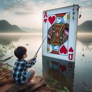

# Le Go Fish

> Source : [Le Go Fish](https://jeuxdecartes1.e-monsite.com/pages/jeux-de-familles/le-go-fish.html)

♦ **Matériel** : Un jeu de 52 cartes (sans Joker)

♦ **Nombre de joueurs** : Entre 2 et 6 joueurs

♦ **Objectif** : Former plus de combinaisons de cartes que ses adversaires

♦ **Nombre de cartes pour chaque joueur** : 5 cartes (7 cartes à 2 joueurs)

♦ **Règle du jeu** : Également connu sous le nom de ***Pêche*** dans les pays francophones, le ***Go Fish***, ou simplement ***Fish***, est un jeu de familles assez populaire. Les cartes non distribuées forment la pioche. Chaque joueur, à son tour de jouer, doit former un ensemble de 4 cartes de même valeur – par exemple ♠4, ♣4, ♥4 et ♦4 –, carré de cartes qu’il dépose ensuite devant lui, face visible. Pour ce faire, il demande une valeur de carte à l’adversaire de son choix ; mais attention, il ne peut demander une valeur de carte que s’il possède déjà une carte de valeur équivalente dans son jeu :

1) Si son adversaire possède une ou plusieurs cartes de la valeur demandée, il doit toutes les lui donner. Le joueur rejoue.

2) Si son adversaire ne possède pas de carte de cette valeur, il lui dit « ***Go Fish !*** ». Le joueur pioche une carte :

- Si la carte piochée est une carte de la valeur souhaitée, il la montre aux autres joueurs et rejoue ;
- Si la carte piochée n’est pas une carte de la valeur souhaitée, il la garde dans son jeu. Le joueur situé à sa gauche enchaîne.

Dès lors qu’un joueur récolte un carré de cartes de même valeur, il doit immédiatement le déposer devant lui ; c’est au tour du joueur suivant. Le jeu se termine lorsque la pioche est épuisée ou lorsqu’un joueur n’a plus de cartes en main. Le gagnant est le joueur ayant formé le plus de combinaisons de 4 cartes.

---

♦ **Variantes** :

1) Pour corser le jeu, une variante impose aux joueurs de demander des cartes spécifiques plutôt que de demander toutes les cartes d’une même famille. Ainsi, au lieu de demander à un joueur s’il a des Valets doit-on lui demander, par exemple, s’il a le ♠Valet.

2) Pour simplifier le jeu, les joueurs doivent réaliser des paires, c’est-à-dire rassembler deux cartes de même valeur, indifféremment de leur couleur. Une paire ne peut être thésaurisée, c’est-à-dire qu’elle doit être posée aussitôt qu’elle est obtenue.

3) Il existe une version ***sans pioche*** de ***Go Fish*** (appelée ***Authors*** aux États-Unis) dans laquelle toutes les cartes sont distribuées équitablement entre les joueurs.
