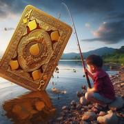

# Le Go Fish Deluxe

> Source : [Le Go Fish Deluxe](https://jeuxdecartes1.e-monsite.com/pages/jeux-de-familles/le-go-fish-deluxe.html)

♦ **Matériel** : Un jeu de 52 cartes et 2 Jokers

♦ **Nombre de joueurs** : Entre 2 et 6 joueurs

♦ **Objectif** : Collecter le maximum de paires

♦ **Nombre de cartes pour chaque joueur** : 7 cartes

♦ **Règle du jeu** : Le ***Go Fish Deluxe*** est une variante très sympathique du [***Go Fish***](http://jeuxdecartes1.e-monsite.com/pages/jeux-de-familles/le-go-fish.html) imaginée par Jonny Groves. Les paires que les joueurs ont en main, après distribution, sont immédiatement disposées, face visible, sur la table de jeu. Les cartes non distribuées forment la pioche. Chaque joueur, à son tour de jouer, demande une valeur de carte à l’adversaire de son choix dans le but de former le maximum de paires (par exemple : ♠Valet et ♦Valet) ; mais attention, il ne peut demander une valeur de carte que s’il possède déjà une carte d’une valeur équivalente dans son jeu :

1) Si son adversaire possède une carte de cette valeur, il la lui donne. Le joueur pose immédiatement devant lui la paire constituée et rejoue.

2) Si son adversaire ne possède pas de carte de cette valeur, il lui dit « ***Go Fish !*** ». Le joueur pioche une carte :

- Si la carte piochée est une carte de la valeur souhaitée, il pose la paire devant lui et rejoue ;
- Si la carte piochée n’est pas une carte de la valeur souhaitée, c’est au tour du joueur suivant, situé à sa gauche. Néanmoins, si cette carte forme une paire avec une autre carte de son jeu, le joueur doit poser les cartes appariées devant lui.

Un joueur à court de cartes avant la fin du jeu doit en piocher 7 nouvelles (ou moins, en fonction du nombre de cartes restantes dans la pioche) ; la partie reprend avec le joueur dont c’était le tour. Le jeu se termine une fois que toutes les cartes ont été appariées ; ainsi, lorsque la pioche est épuisée, il n’y a plus de « ***Go Fish !*** » et un joueur à court de cartes ne peut plus jouer. Le gagnant est le joueur ayant totalisé le plus de points grâce aux paires qu’il a collectées : une paire vaut ***1 point***, la paire de Jokers vaut ***2 points*** et un carré (quatre cartes de même valeur) vaut ***3 points***.
