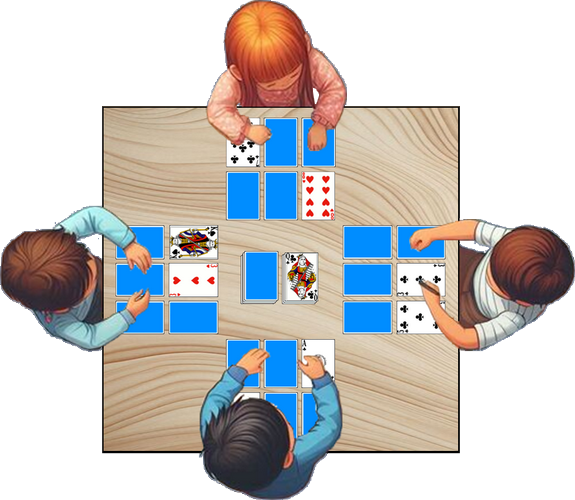

# Le Golf (à 6 cartes)

> Source : [Le Golf (à 6 cartes)](https://jeuxdecartes1.e-monsite.com/pages/jeux-de-pioche-defausse/le-golf-a-6-cartes.html)

♦ **Matériel** : Un jeu de 52 cartes (sans Joker) et deux jeux à partir de 5 joueurs

♦ **Nombre de joueurs** : Entre 2 et 8 joueurs

♦ **Objectif** : Totaliser moins de points que ses adversaires après neuf (ou dix-huit) manches

♦ **Nombre de cartes pour chaque joueur** : 6 cartes, disposées en rectangle devant chaque joueur

♦ **Règle du jeu** : Le donneur distribue 6 cartes à chaque joueur, pose la pioche au centre, face cachée, et retourne une carte à côté, fondement de la pile de défausse. Chaque joueur dispose ses 6 cartes devant lui en rectangle (disposition qui ne doit pas changer en cours de jeu) et retourne, face visible, deux cartes de son choix. Les autres cartes ne peuvent être regardées. Voici la disposition à 4 joueurs :

À son tour de jouer, au choix :

1) Le joueur pioche une carte et la repose dans la défausse.

2) Le joueur pioche une carte ou prend la dernière carte de la défausse et la dispose ***face visible*** dans son jeu en remplacement d’une carte (face visible ou face cachée) qu’il jette dans la défausse.

Attention, comme dans la version du ***Golf*** à quatre cartes, un joueur n’est pas autorisé à regarder une carte qu’il décide de remplacer si celle-ci est disposée face cachée !

Le jeu se termine immédiatement lorsque la dernière des 6 cartes d’un joueur est retournée, face visible. Les cartes face cachée de chaque joueur sont alors retournées pour le décompte des points. Le joueur ayant le total de points le plus bas après ***neuf manches*** (ou ***dix-huit manches***) est déclaré gagnant.

La valeur des cartes :

- **As**, **3**, **4**, **5**, **6**, **7**, **8**, **9** et **10** : valeur numérique (de 1 à 10 points)
- **2** : - 2 points
- **Valet**,** Dame** : 10 points
- **Roi** : 0 point** **
- Une ***paire*** de cartes de même valeur dans une même colonne : 0 point pour la colonne (même s’il s’agit d’une paire de 2).** **

---

♦ **Variantes ** :

1) Au lieu de retourner deux cartes en début de jeu, une variante propose aux joueurs de regarder - une seule fois - la rangée de trois cartes la plus proche d’eux, avant de replacer les cartes face cachée.

2) Une variante très jouée emprunte cette règle du ***Golf ***à 4 cartes : lorsqu’un joueur retourne sa dernière carte, un dernier tour s’engage entre les joueurs, à l’exclusion de celui ayant le premier retourné ses six cartes ; la manche se termine quand le dernier joueur a jeté sa carte.

3) Certains joueurs comptent ***- 10 points*** pour quatre cartes de même valeur disposées en deux colonnes (par exemple, deux colonnes contenant chacune deux Valets).
