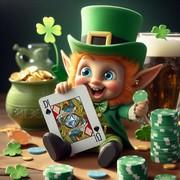

# Le Gops

> Source : [Le Gops](https://jeuxdecartes1.e-monsite.com/pages/jeux-divers/le-gops.html)

♦ **Matériel** : Un jeu de 52 cartes (sans Joker), deux jeux à partir de 4 joueurs

♦ **Nombre de joueurs** : Entre 2 et 6 joueurs

♦ **Objectif** : Totaliser le plus de points en remportant des enchères

♦ **Nombre de cartes pour chaque joueur** : 13 cartes d’une même couleur : ♠, ♣ ou ♥

♦ **Valeur des cartes, de la plus faible à la plus forte** : As – 2 – 3 – 4 – 5 – 6 – 7 – 8 – 9 – 10 – Valet – Dame – Roi

♦ **Règle du jeu** : Le ***Gops***, acronyme de ***Game of Pure Strategy***, est un jeu de bluff et de stratégie dont le mécanisme, assez particulier, ressemble beaucoup à celui d’un jeu de levées. Il aurait été inventé par Merril M. Flood, un mathématicien américain, dans les années 1930, et portait originellement le nom germanique de ***Goofspiel***.

Les treize ♦ sont mélangés et posés face contre table en un paquet, hormis le premier, retourné sur le dessus. Pendant ce temps, chaque joueur prend en main les 13 cartes d’une même couleur : ♠, ♣ ou ♥. Pour acquérir la carte retournée, chacun fait une offre, choisissant une carte de sa main et la disposant face cachée devant lui. Les cartes sont ensuite révélées, et le joueur dont l’enchère est la plus élevée remporte le prix – la carte ♦ –, qu’il dispose devant lui ; les cartes d’enchère sont mises à l’écart. Si les deux meilleures offres sont égales, les cartes de tous les joueurs sont mises à l’écart, et une deuxième carte ♦ est retournée, l’offre suivante engageant les deux prix, et ainsi de suite, tous les joueurs pouvant de nouveau enchérir. Si cette éventualité se présente pour les dernières offres, les prix sont annulés.

La valeur des cartes :

- **As**, **2**, **3**, **4**, **5**, **6**, **7**, **8**, **9** et **10** : valeur numérique (de 1 à 10 points)
- **Valet** : 11 points
- **Dame** : 12 points
- **Roi** : 13 points

À la fin de la partie, c’est-à-dire lorsque toutes les cartes ont été jouées, chaque joueur fait le total de ses gains, et celui ayant obtenu le plus de points est déclaré gagnant.
