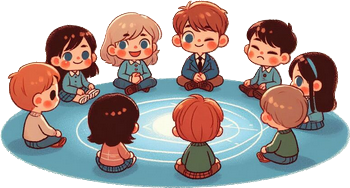

# Le Killer

> Source : [Le Killer](https://jeuxdecartes1.e-monsite.com/pages/jeux-de-role/le-killer.html)

♦ **Matériel** : Un jeu de 32 cartes (sans Joker) duquel on retire des cartes

♦ **Nombre de joueurs** : Entre 6 et 18 joueurs

♦ **Nombre de cartes pour chaque joueur** : 1 carte

♦ **Règle du jeu** : Le ***Killer***, également connu sous les noms d’***Assassin*** ou de ***Wink Murder***, est un jeu de rôle apparu au début du XXe siècle. D’un paquet de 32 cartes, on retire autant de cartes qu’il y a de joueurs, nécessairement un As et un Roi, puis on complète par les cartes numériques, de 7 à 10.

Le joueur qui pioche le Roi endosse le rôle de ***détective*** ; il révèle son identité, se lève et se place au centre du cercle formé par les joueurs. Sa tâche est d’identifier l’assassin, c’est-à-dire le joueur ayant pioché l’As : il peut commencer ses accusations après le premier meurtre et gagne s’il trouve l’identité du coupable avant, ou pour, sa troisième accusation.

De son côté, l’***assassin*** doit tuer discrètement les autres joueurs en leur faisant un clin d’œil (bien sûr, lui seul est autorisé à en faire). Il gagne s’il n’est pas démasqué par le détective. Un joueur qui reçoit un clin d’œil s’allonge ou quitte le cercle, après simulation d’une mort dramatique, sans révéler l’identité du meurtrier.

---

♦ **Variantes** :

1) Une variante stipule qu’en cas de défaite du détective, celui-ci conserve son rôle pour la partie suivante. En revanche, s’il gagne, c’est l’assassin qui endossera son rôle. Avec cette règle, il convient de retirer le Roi des cartes distribuées en début de jeu, car seule est secrète l’identité de l’assassin.

2) Ce jeu peut également se passer de matériel. Pendant que les joueurs sont assis en cercle, les yeux fermés, un sélectionneur (qui ne participe pas au jeu) tapote une fois sur la tête de l’assassin et deux fois sur celle du détective. Une fois fait, les joueurs ouvrent les yeux et le détective se place au centre du cercle avec pour objectif d’identifier l’assassin le plus rapidement possible. Il existe également d’autres variantes du jeu où l’identité de l’assassin est connue des autres joueurs, à l’exception du détective.

3) [***Candyman***](https://jeuxdecartes1.e-monsite.com/pages/jeux-de-role/candyman.html) est une variante de ce jeu.
