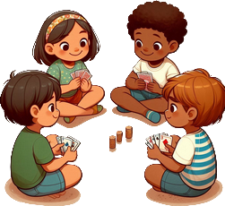

# Le Kilo de Merde

> Source : [Le Kilo de Merde](https://jeuxdecartes1.e-monsite.com/pages/jeux-de-passes-de-cartes/le-kilo-de-merde.html)

♦ **Matériel** : Un jeu de 52 cartes (sans Joker), et des bouchons en liège dans la variante

♦ **Nombre de joueurs** : Entre 3 et 6 joueurs

♦ **Objectif** : Être réactif pour éviter les kilos de merde

♦ **Nombre de cartes pour chaque joueur** : 4 cartes

♦ **Règle du jeu** : Le paquet de cartes est séparé en deux tas : une pioche (le ***tas de merde***) et les cartes à distribuer. À 3 joueurs, on distribue les Rois, les Dames et les Valets ; à 4 joueurs, on ajoute les 2 ; à 5 joueurs, les 3 ; à 6 joueurs, les 4. Avant de jouer, les joueurs conviennent du nombre de manches à jouer et à l’issue duquel les résultats seront donnés.

La personne qui a la ♥Dame commence : il passe une carte de son choix à son voisin de gauche. Le but de chaque joueur étant d’avoir 4 cartes de valeur identique en main, le premier à jouer choisit une carte qu’il ne veut pas garder et la fait passer à son voisin de gauche sans la montrer aux autres. À ce moment-là, le premier joueur a 3 cartes et le deuxième en a 5. À son tour, le deuxième joueur fait passer une carte à son voisin de gauche. Et ainsi de suite. Une carte ne peut pas faire deux tours de suite : autrement dit, si un joueur transmet une carte à un autre joueur et que cette carte lui revient au bout d’un tour, il ne doit plus la lancer pour un second tour.

Lorsque l’un des joueurs réunit 4 cartes de même valeur, il doit attendre que tout le monde ait 4 cartes dans son jeu pour poser sa main sur le tas de merde, tous les joueurs devant l’imiter au plus vite. Le dernier à toucher le tas de merde doit y piocher une carte et la poser devant lui, face visible, ramassant autant de kilos de merde que la valeur indiquée par la carte. Les As valent 100 kilos. Un joueur frappant par erreur sur le tas de merde (peut-être à cause d’une feinte d’un adversaire) doit également y piocher une carte, récoltant autant de kilos de merdre qu’indiqué.

Lorsqu’un joueur a ramassé ses kilos de merde, la manche se termine : les cartes sont mélangées, redistribuées et une nouvelle manche commence. Quand un joueur tire un 7 dans le tas de merde, il se débarrasse de toute sa merde, qu’il remet sous la pioche : on dit qu’il tire la chasse. Cependant, si ce 7 est la première carte tirée par un joueur (éventuellement après une chasse), alors sa valeur est de 7 kilos de merde. Le gagnant est le joueur ayant le moins de kilos de merde à l’issue d’un nombre de manches prédéfini.

---

♦ **Variante** : Une variante du jeu, appelée ***Bouchon*** (ou ***Jeu du Bouchon***) consiste à disposer des bouchons (de préférence en liège) au centre du jeu, à raison d’un de moins que le nombre de joueurs. Ainsi, un joueur pioche une carte dans le tas de merde lorsqu’il ne parvient pas à récupérer de bouchon.

