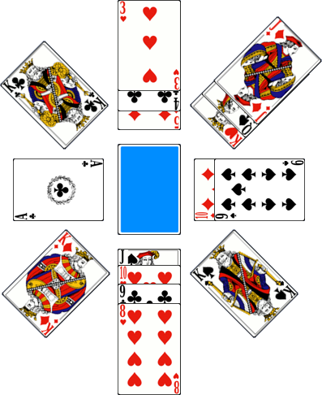

# Le Kings Corners

> Source : [Le Kings Corners](https://jeuxdecartes1.e-monsite.com/pages/jeux-d-appariemment/le-kings-corners.html)

♦ **Matériel** : Un jeu de 52 cartes (sans Joker)

♦ **Nombre de joueurs** : Entre 2 et 6 joueurs

♦ **Objectif** : Se débarrasser le premier de toutes ses cartes

♦ **Nombre de cartes pour chaque joueur **: 7 cartes

♦ **Valeur des cartes, de la plus faible à la plus forte** : As – 2 – 3 – 4 – 5 – 6 – 7 – 8 – 9 – 10 – Valet – Dame – Roi

♦ **Règle du jeu** : Le ***Kings Corners***, connu en France sous le nom de ***Rois dans les Coins*** ou ***Rois aux Quatre Coins***, fait partie de la grande famille des jeux de réussites. Un joueur distribue 7 cartes à chaque joueur et pose la pioche au centre, face cachée. Quatre cartes sont retournées, face visible, une sur chaque côté – Nord, Sud, Est et Ouest –, constituant les fondations de quatre piles. À son tour de jouer, au choix et dans n’importe quel ordre :

1) Le joueur joue une carte de sa main sur une pile, carte qui doit être de valeur immédiatement inférieure et de couleur opposée à la carte sur laquelle il la pose ; ainsi, le ♥9 peut être posé sur le ♠10 ou le ♣10. Les cartes doivent se chevaucher légèrement afin d’être toutes visibles. Les As sont les dernières cartes et aucune carte ne peut être posée dessus.

2) Le joueur place un Roi de sa main dans un espace vide sur l’un des quatre coins – Nord-Ouest, Sud-Ouest, Nord-Est et Sud-Est –, fondation d’une nouvelle pile, sur laquelle une Dame de la couleur opposée peut être posée, et ainsi de suite. À noter, un joueur n’a pas le droit de garder un Roi dans sa main ; il est obligé de le poser lorsque vient son tour.

3) Le joueur peut déplacer une pile entière de cartes sur une autre pile si la carte du bas de l’échelle mobile est de valeur immédiatement inférieure et de couleur opposée à la carte sur le dessus de la pile sur laquelle est conclu le déplacement ; ainsi, la pile ♠8 - ♦7 - ♠6 peut être déplacée sur la pile ♣10 - ♥9.

4) Le joueur peut jouer n’importe quelle carte de sa main sur un espace Nord, Sud, Est ou Ouest devenu vide, les cartes ayant été déplacées sur une autre pile.

Après qu’un joueur a joué toutes les cartes qu’il peut ou qu’il veut, et s’il lui reste au moins une carte en main, ***il pioche une carte ***pour mettre fin à son tour de jeu ; c’est au tour du joueur suivant. En début de jeu, il se peut que les cartes de fondations s’empilent entre elles, libérant un ou plusieurs espaces. De même, les Rois disposés au début sur les piles Nord, Sud, Est et Ouest devront être déplacés dans les coins par le joueur qui entame la partie. Si la pioche est épuisée, le jeu continue sans pioche.

Une manche se termine lorsqu’un joueur parvient à se débarrasser de toutes les cartes, ou quand, après épuisement de la pioche, aucun joueur ne peut ou ne veut plus jouer d’autres cartes. Les joueurs reçoivent alors un point de pénalité pour chaque carte qui leur reste en main, et 10 points pour chaque Roi. Une partie se joue jusqu’à ce qu’un joueur atteigne ou dépasse un total de points convenu (généralement ***25 points*** ou ***50 points***) ; le gagnant est celui avec le moins de points de pénalité.

---

♦ **Variantes** :

1) Une variante du jeu propose de ***piocher une carte en début de son tour de jeu** *plutôt qu’à la fin.

2) Pour plus de facilité, il est possible de jouer sans manches (c’est-à-dire sans compter les points de pénalité) : chaque fois, le gagnant est donc le premier joueur à s’être débarrassé de toutes ses cartes.

3) ***Couronnement*** : Dans cette variante pour 2 joueurs imaginée par David Stiefel, chaque fois qu’un joueur achève une suite dans l’un des quatre coins, en jouant un As, il marque ***1 point*** : c’est ce qu’on appelle ***un couronnement***. De plus, contrairement au jeu original, le joueur qui se débarrasse le premier de toutes ses cartes continue de jouer (en piochant une nouvelle main de 7 cartes) et marque ***1 point*** : on dit qu’***il tue le dragon***. La manche prend fin lorsque toutes les cartes ont été jouées. Parmi les ***5 points*** en jeu (quatre couronnements et un dragon tué), le gagnant est le joueur qui en gagne le plus : trois points contre deux est une « victoire normale », quatre points contre un est une « victoire incroyable » et cinq points contre zéro est une « victoire absolue ».
