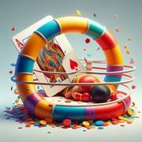

# Le Knock-out Whist

> Source : [Le Knock-out Whist](https://jeuxdecartes1.e-monsite.com/pages/jeux-de-levees/le-knock-out-whist.html)

♦ **Matériel** : Un jeu de 52 cartes (sans Joker)

♦ **Nombre de joueurs** : Entre 2 et 7 joueurs

♦ **Objectif** : Remporter des levées pour ne pas être éliminé

♦ **Nombre de cartes pour chaque joueur** : 7 cartes dans la première manche, puis en nombre décroissant

♦ **Valeur des cartes, de la plus faible à la plus forte** : 2 – 3 – 4 – 5 – 6 – 7 – 8 – 9 – 10 – Valet – Dame – Roi – As

♦ **Règle du jeu** : Le ***Knock-out Whist ***est un jeu de levées originaire de Grande-Bretagne se déroulant en 7 manches maximum. Pour commencer, le donneur distribue 7 cartes à chaque joueur, dans le sens horaire, pose la pioche au centre et retourne à côté la carte suivante, qui détermine la couleur d’atout. Le joueur à sa gauche commence en posant une première carte de son choix. Les joueurs suivants, s’ils le peuvent, répondent à la couleur demandée ou coupent (jouent un atout) ; dans le cas contraire, ils se défaussent de n’importe quelle carte de leur main. La levée est remportée par l’atout le plus fort ou, à défaut, par la carte la plus forte dans la couleur demandée. Le gagnant de la levée entame le tour suivant.

Une fois toutes les cartes jouées, le donneur pour la manche suivante (situé à gauche du précédent donneur) les ramasse, les mélange et en distribue 6 à chaque joueur. Le jeu continue ainsi, avec une carte de moins par joueur à chaque nouvelle manche, jusqu’à la dernière manche, où seule une carte est distribuée. Le joueur ayant remporté le plus de levées choisit la couleur d’atout pour la manche suivante après examen de ses cartes. En cas d’égalité, les joueurs impliqués coupent le jeu avant distribution : le choix revient à celui dont la carte visible à l’endroit de la coupe est de plus grande valeur.

Un joueur qui ne remporte aucune levée dans une manche est mis ***KO*** (***Knock-out***), ne reçoit plus de cartes et ne prend plus part à la partie. Néanmoins, si le joueur mis KO est à la gauche immédiate du donneur, ce joueur devra tout de même distribuer pour la manche suivante avant de quitter la partie ; de cette façon, le joueur à la gauche de ce dernier n’est pas privé de la chance d’entamer une nouvelle manche.

Le gagnant est le dernier joueur encore en vie, c’est-à-dire celui ayant remporté toutes les levées au cours d’une manche.

---

**♦ Variante (avec la dog’s life) : Dans cette variante, **le premier joueur à ne ramasser aucune carte lors d’une manche n’est pas immédiatement mis KO, mais se voit accorder la dog’s life.

Pour la manche suivante, il ne reçoit qu’une seule carte et décide à quel moment la jouer ; ainsi, lorsque vient son tour (même s’il est le premier à jouer, en début de manche), ou bien il la joue, ou bien il frappe sur la table et la garde pour un tour ultérieur. S’il parvient à prendre une levée avec sa carte, il reçoit une main normale pour la manche suivante, comme les autres joueurs survivants ; c’est le joueur à sa gauche qui jouera en premier. En revanche, s’il n’y parvient pas, il est éliminé.

En outre, si deux joueurs ou plus ne remportent aucune levée, et qu’aucun joueur n’a encore utilisé la dog’s life, ces joueurs en obtiennent chacun une.
