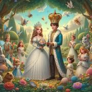

# Le Mariage

> Source : [Le Mariage](https://jeuxdecartes1.e-monsite.com/pages/jeux-de-levees/le-mariage.html)

♦ **Matériel** : Un jeu de 32 cartes (sans Joker)

♦ **Nombre de joueurs** : À 2 joueurs

♦ **Objectif** : Totaliser plus de points que son adversaire en remportant stratégiquement des levées

♦ **Nombre de cartes pour chaque joueur** : 5 cartes

♦ **Valeur des cartes, de la plus faible à la plus forte** : 7 – 8 – 9 – Valet – Dame – Roi – 10 – As

♦ **Règle du jeu** : Le*** Mariage***, aussi appelé ***Brisque, ***est un jeu de levées d’origine italienne ou espagnole. Un joueur mélange le paquet de cartes, le donne à couper à son adversaire et distribue 5 cartes à chacun. Il pose la pioche au centre et retourne à côté la onzième carte, qui détermine la couleur d’atout. Si un joueur détient parmi ses cartes le 7 dans la couleur de l’atout, il peut alors l’échanger contre l’atout (la carte retournée) tant que la pioche n’est pas épuisée.

Le joueur n’ayant pas distribué commence la partie en jouant une carte de sa main puis en tirant une carte de la pioche. L’autre joueur joue à son tour une carte à côté de la première, avant de piocher une nouvelle carte :

1) Il peut jouer une carte dans la couleur demandée, la hiérarchie des cartes étant, de la plus faible à la plus forte : 7 – 8 – 9 –Valet – Dame – Roi – 10 – As.

2) Il peut jouer une carte dans la couleur de l’atout, une carte dans la couleur de l’atout l’emportant sur les autres couleurs.

3) Il peut, s’il reste des cartes dans la pioche, ne pas répondre à la couleur demandée et se défausser d’une carte de son choix, même en ayant une carte plus forte dans la couleur demandée ou un atout plus fort.

Le joueur qui remporte la levée entame le tour suivant.

Lorsqu’il n’y a plus de cartes dans la pioche – la dernière carte piochée étant la carte d’atout initialement retournée, possiblement échangée par le 7 d’atout – les joueurs, s’ils le peuvent, doivent obligatoirement fournir la couleur demandée, couper (jouer un atout) ou surcouper (si la couleur demandée est la couleur d’atout), et ce, jusqu’à ce que toutes les cartes de leur main aient été jouées.

Les joueurs effectuent le comptage des points, et celui ayant totalisé le plus de points gagne la partie. Le comptage des points tient compte de la valeur individuelle des cartes et des « mariages » que les joueurs détiennent dans les levées qu’ils ont réalisées.

La valeur des cartes :

- **7**, **8 **et** 9** : 0 point
- **Valet **: 2 points
- **Dame** : 3 points
- **Roi** : 4 points
- **10** : 10 points
- **As** : 11 points
- **Le Mariage** (**Roi** et **Dame d’une même couleur**) : 20 points
- **Le Mariage d’atout** (**Roi** et **Dame dans la couleur d’atout**) : 40 points
- **La dernière levée** : 10 points

Ainsi, par exemple, un joueur détenant dans les levées qu’il a réalisées le Roi et la Dame d’une même couleur (autre que l’atout), compte 20 points supplémentaires, en plus des 7 points que le couple royal lui a valus. Notons que le joueur remportant la dernière levée gagne 10 points supplémentaires.
