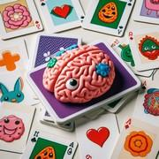

# Le Memory

> Source : [Le Memory](https://jeuxdecartes1.e-monsite.com/pages/jeux-de-memoire/le-memory.html)

♦ **Matériel** : Un jeu de 32 cartes (sans Joker) duquel on retire les 7 et les 8

♦ **Nombre de joueurs** : Entre 2 et 6 joueurs

♦ **Objectif** : Apparier plus de cartes que ses adversaires

♦ **Règle du jeu** : Le ***Memory***, aussi appelé ***Concentration***, *Match Match*,*** Pelmanism*** ou ***Jeu de Paires***, est un jeu de mémoire apparu au XIXe siècle dans les pays anglophones, mais un célèbre jeu japonais consistant à apparier des coquillages peints, appelé ***Kai-Awase***, existait déjà au XIIe siècle. La première version éditée, quant à elle, date de 1959. Les 24 cartes sont mélangées et ordonnément disposées sur la table, face cachée, sans se superposer, dessinant un rectangle, un cercle ou toute autre forme souhaitée. Chaque joueur, à tour de rôle, retourne deux cartes au hasard, les laissant momentanément à la vue des autres joueurs :

1) Si les cartes sont de même couleur et de même valeur – par exemple ♠10 et ♣10 – elles s’apparient. Le joueur les retire, les place devant lui et rejoue.

2) Si les cartes ne sont pas de même couleur et de même valeur, il les retourne, face cachée, au même endroit. C’est au tour du joueur suivant.

Le jeu continue jusqu’à ce que toutes les cartes soient appariées. Le gagnant est le joueur ayant marié le plus de cartes.

Remarque : Pour varier la difficulté, les joueurs peuvent jouer avec plus ou moins de 24 cartes.

---

♦** Variantes :**

1) Dans la version ***sans couleurs***, la plus simple de ce célèbre jeu, les paires doivent être composées de deux cartes de même valeur, indifféremment de leur couleur : ainsi, les paires ♣8 - ♦8, ♣8 - ♥8 et ♣8 - ♠8 sont acceptées.

2) Dans la version*** zébra***, les paires doivent être formées de cartes de même valeur mais de couleur opposée : une carte rouge (♦ ou ♥) s’apparie avec une carte noire (♣ ou ♠).

3) Dans la version*** additions***, on conserve les cartes de l’As au 6 (d’un paquet de 52 cartes). Celles-ci s’apparient si leur total est égal à 7 : ainsi, les As s’apparient avec les 6, les 2 avec les 5, et les 3 avec les 4.

4) Dans la version*** trios***, qui propose de reconstituer des brelans, on conserve trois 7, trois 8, trois 9, trois 10, trois Valets, trois Dames, trois Rois et trois As. À son tour, chaque joueur retourne deux cartes au hasard ; si celles-ci forment une paire, il en retourne une troisième : si les trois cartes sont de même valeur, le joueur les place devant lui et rejoue ; dans le cas contraire, il retourne les trois cartes, face cachée. C’est au tour du joueur suivant. Voir également le ***[Memory Coopératif](https://jeuxdecartes1.e-monsite.com/pages/jeux-de-memoire/le-memory-cooperatif.html)***.
