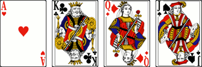

# Le Michigan

> Source : [Le Michigan](https://jeuxdecartes1.e-monsite.com/pages/jeux-d-appariemment/le-michigan.html)

♦ **Matériel** : Un jeu de 52 cartes (sans Joker), quatre cartes d’un deuxième jeu (♠Valet, ♦Dame, ♣Roi et ♥As) et des jetons

♦ **Nombre de joueurs** : Entre 3 et 8 joueurs

♦ **Objectif** : Remporter des mises et se débarrasser le premier de toutes ses cartes

♦ **Nombre de cartes pour chaque joueur** : Toutes les cartes sont distribuées équitablement, une différence d’une carte étant possible entre les joueurs

♦ **Valeur des cartes, de la plus faible à la plus forte** : 2 – 3 – 4 – 5 – 6 – 7 – 8 – 9 – 10 – Valet – Dame – Roi – As

♦ **Règle du jeu** : Le ***Michigan*** est la version américaine de ***Newmarket***, jeu anglais dont les origines remontent à la fin du XIXe siècle. Avant la distribution, quatre cartes d’un deuxième jeu, appelées ***cartes paye*** (ou ***cartes boodle***), sont disposées comme suit ; sur chacune, le donneur place deux jetons et les autres joueurs placent un jeton :

​​​​​​La distribution se fait dans le sens horaire, carte par carte, en plus d’une main de rechange non utilisée pendant le jeu. Chaque joueur est donneur à tour de rôle. Le joueur à gauche du donneur commence en jouant la carte la plus basse dans l’une des couleurs de son choix (toutes les cartes jouées doivent être posées, face visible, devant chaque joueur et sont conservées devant celui qui les a jouées jusqu’à la fin de la partie). Celui possédant la prochaine carte de valeur supérieure dans la même couleur doit alors la poser, et ainsi de suite, jusqu’à ce que l’As soit atteint ou que personne ne puisse plus jouer (en effet, la carte supérieure peut avoir été posée plus tôt ou être dans la main de rechange). Une carte que personne ne peut suivre s’appelle une ***carte stop***.

Le dernier joueur ayant posé un As ou une carte stop entame le prochain tour avec, encore une fois, la carte la plus basse dans la couleur de son choix. Dès lors qu’un joueur n’a plus de cartes dans sa main, tous les autres joueurs lui payent un jeton pour chaque carte qu’il leur reste. Les cartes sont ensuite rassemblées et distribuées pour une nouvelle manche. Généralement, la partie se termine quand un joueur est à court de jetons, le gagnant étant celui qui en possède le plus.

Pendant le jeu, quiconque réussit à jouer une carte qui correspond à l’une des cartes paye prend tous les jetons misés sur cette carte ; les jetons n’ayant pas été remportés restent sur les cartes paye pour la manche suivante.
