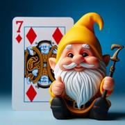

# Le Nain Jaune

> Source : [Le Nain Jaune](https://jeuxdecartes1.e-monsite.com/pages/jeux-d-appariemment/le-nain-jaune.html)

♦ **Matériel** : Un jeu de 52 cartes (sans Joker), des jetons et un tableau/plateau de jeu

♦ **Nombre de joueurs** : Entre 3 et 8 joueurs

♦ **Objectif** : Se débarrasser le premier de toutes ses cartes et ramasser le maximum de jetons

♦ **Nombre de cartes pour chaque joueur** : 6 à 15 cartes (en fonction du nombre de joueurs)

♦ **Valeur des cartes, de la plus faible à la plus forte** : As – 2 – 3 – 4 – 5 – 6 – 7 – 8 – 9 – 10 – Valet – Dame – Roi

♦ **Règle du jeu** : Apparu au XVIIIe siècle, le ***Nain Jaune*** est un jeu de cartes autrefois populaire en Europe. En début de partie, chaque joueur reçoit un nombre équivalent de jetons, de couleurs et de valeurs différentes, par exemple cinq jetons de 10 points, dix jetons de 5 points et vingt jetons de 1 point. Le donneur distribue ensuite les cartes, comme suit, et met les cartes restantes de côté :

| **Nombre de joueurs** | **Nombre de cartes par joueur** |
|---|---|
| 3 | 15 |
| 4 | 12 |
| 5 | 9 |
| 6 | 8 |
| 7 | 7 |
| 8 | 6 |

Chaque joueur mise des jetons sur chaque case du plateau, à savoir : un jeton sur le ♦10, deux jetons sur le ♣Valet, trois jetons sur la ♠Dame, quatre jetons sur le ♥Roi et cinq jetons sur le ♦7 (***Nain Jaune***). S’il reste des jetons de la manche précédente, ils sont conservés et s’ajoutent donc à la nouvelle mise.

Le jeu se joue dans le sens horaire, c’est donc le joueur situé à gauche du donneur qui commence : celui-ci pose une première carte de n’importe quelle valeur et poursuit avec les cartes de valeur immédiatement supérieure, peu importe leur couleur, de manière à former une suite croissante (de l’As au Roi). S’il ne peut ou ne veut plus jouer, il s’arrête et s’écrie « sans » suivi de la valeur de la carte manquante (par exemple : « ***Sans Valet !*** ») ; c’est le joueur à sa gauche qui poursuit. Et ainsi de suite. Si aucun des joueurs n’a la carte qui manque, le dernier à avoir joué entame une nouvelle suite avec la carte de son choix. Enfin, lorsqu’un joueur pose un Roi, il annonce « ***Roi et je recommence !*** » et, de même, entame une nouvelle suite. Quand un joueur pose l’une des cinq cartes du plateau (le ♥Roi, par exemple), il annonce « ***Roi qui prend !*** » et ramasse les jetons misés sur la case correspondant à la carte ; s’il oublie, la mise est perdue pour la partie en cours.

Le premier joueur à s’être débarrassé de toutes ses cartes s’écrie « ***J’arrête !*** » ; les autres joueurs lui paient alors 1 point pour chaque carte qu’il leur reste. De plus, si, à la fin de la manche, un joueur a dans sa main l’une des cartes du plateau, il doit doubler la mise présente dans la case correspondante ; par exemple, si la case contient 5 points, il y rajoutera cinq jetons de 1 point ou un jeton de 5 points. Les cartes sont ensuite rassemblées et mélangées pour une nouvelle manche. La partie se termine lorsqu’un joueur ne peut plus miser ou payer un autre joueur ; le gagnant est celui avec le plus de jetons.

Le Grand Opéra : Lorsqu’un joueur se débarrasse de toutes ses cartes au premier tour de jeu (on dit qu’il fait un ***Grand Opéra***), il reçoit, en plus du paiement des autres joueurs, tous les jetons misés sur le plateau.

Voici le plateau de jeu : 

---

******Variante** : Dans une variante du jeu, le premier joueur à s’être débarrassé de toutes ses cartes reçoit des autres joueurs l’équivalent en jetons de la valeur des cartes leur restant en main ; les cartes de l’As au 10 comptent pour leur valeur numérique et les figures valent 10 points chacune.
