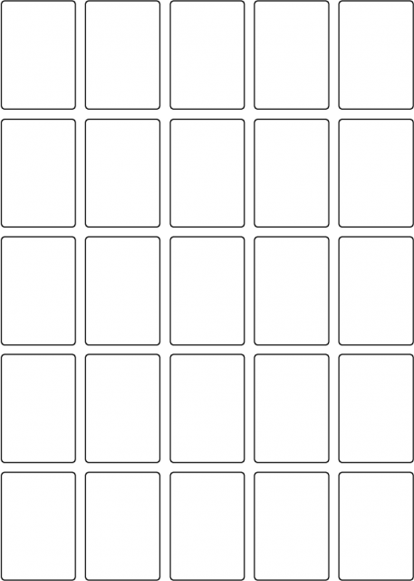

# Le Poker Squares

> Source : [Le Poker Squares](https://jeuxdecartes1.e-monsite.com/pages/jeux-d-appariemment/le-poker-squares.html)

♦ **Matériel** : Un jeu de 52 cartes (sans Joker)

♦ **Nombre de joueurs** : Entre 2 et 6 joueurs

♦ **Objectif** : Former des combinaisons de Poker pour marquer un minimum de 200 points

♦ **Valeur des cartes, de la plus faible à la plus forte** : As – 2 – 3 – 4 – 5 – 6 – 7 – 8 – 9 – 10 – Valet – Dame – Roi – As

♦ **Règle du jeu** : Le ***Poker Squares***, également connu sous les noms de ***Poker Patience*** et ***Poker Solitaire***, est un jeu de réussite. Dans sa version à plusieurs joueurs, comme décrit sur cette page, il prend la forme d’un jeu coopératif bien singulier. À tour de rôle, chacun pioche une carte et la pose sur l’un des espaces vides d’une grille de 5 par 5 :

Lorsqu’une carte est posée, elle ne peut plus être déplacée. Une fois les 25 cartes distribuées, les joueurs comptabilisent les points des dix (meilleures) combinaisons réalisées en ligne et en colonne. Pour gagner, l’équipe doit marquer un minimum de ***200 points***.

Système de notation :

| **La paire** | Deux cartes de même valeur | 2 points |
|---|---|---|
| **La double-paire** | Deux paires | 5 points |
| **Le brelan** | Trois cartes de même valeur | 10 points |
| **La quinte** | Cinq cartes qui se suivent | 15 points |
| **La couleur** | Cinq cartes de même couleur | 20 points |
| **Le full** | Une paire et un brelan | 25 points |
| **Le carré** | Quatre cartes de même valeur | 50 points |
| **La quinte floche** | Cinq cartes de même couleur qui se suivent | 75 points |
| **La quinte floche royale** | Quinte floche à l’As | 100 points |

Dans l’exemple suivant, l’équipe a réalisé une double-paire (1re ligne), un full (2e ligne), une paire (4e ligne), un brelan (5e ligne), une quinte (1re colonne), une quinte floche (2e colonne), une paire (3e colonne) et une couleur (4e colonne) pour un total de 154 points :

