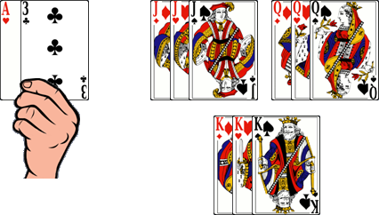

# Le Rami Machiavel

> Source : [Le Rami Machiavel](https://jeuxdecartes1.e-monsite.com/pages/jeux-de-pioche-defausse/le-rami-machiavel.html)

♦ **Matériel** : Deux jeux de 52 cartes (sans Joker)

♦ **Nombre de joueurs** : Entre 2 et 5 joueurs

♦ **Objectif** : Se débarrasser le premier de toutes ses cartes

♦ **Nombre de cartes pour chaque joueur** : 13 cartes

♦ **Valeur des cartes, de la plus faible à la plus forte** : As – 2 – 3 – 4 – 5 – 6 – 7 – 8 – 9 – 10 – Valet – Dame – Roi – As

♦ **Règle du jeu** : Le ***Rami Machiavel*** est un jeu de cartes qui doit son nom au célèbre penseur de la Renaissance italienne Nicolas Machiavel. Le donneur distribue 13 cartes à chaque joueur et pose la pioche au centre. À son tour de jouer, deux possibilités s’offrent au joueur, au choix :

1) Piocher une carte.

2) Poser une ou plusieurs cartes de sa main :

Ou bien il pose une ou plusieurs combinaisons de cartes, parmi lesquelles :

- **Les brelans **: 3 cartes de même valeur et de couleurs différentes, comme ♣2 - ♥2 - ♦2.
- **Les carrés **: 4 cartes de même valeur et de couleurs différentes, comme ♣7 - ♠7 - ♥7 - ♦7.
- **Les suites **: au moins 3 cartes de même couleur qui se suivent, comme ♥3 - ♥4 - ♥5 - ♥6.

Comme au [***Rami***](http://jeuxdecartes1.e-monsite.com/pages/jeux-de-pioche-defausse/le-rami.html), les suites circulaires (du type ♥Roi – ♥As – ♥2) sont interdites.

Ou bien il complète une ou plusieurs combinaisons de cartes présentes sur la table pour en créer de nouvelles, lesquelles faciliteront la pose d’une ou plusieurs cartes de sa main (chaque carte ne pouvant appartenir qu’à une seule combinaison à la fois), par exemple :

Le joueur réorganise les trois brelans en trois suites pour y poser son ♥As :

Une fois posée, une carte ne peut être retirée ; ainsi, en réorganisant les cartes déjà posées, un joueur peut se voir contraint de laisser une ou plusieurs combinaisons invalides, ce qui le condamne à piocher trois cartes avant de terminer son tour de jeu. Par la suite, les cartes invalides laissées sur la table seront incorporées dans des groupes valides par d'autres joueurs.

Le premier joueur à s’être débarrassé de toutes ses cartes gagne la partie.
