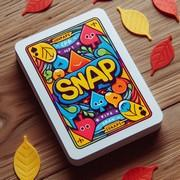

# Le Snap

> Source : [Le Snap](https://jeuxdecartes1.e-monsite.com/pages/jeux-de-bataille/le-snap.html)

♦ **Matériel** : Un jeu de 52 cartes (sans Joker)

♦ **Nombre de joueurs** : Entre 2 et 6 joueurs

♦ **Objectif** : Avoir en sa possession toutes les cartes du jeu

♦ **Nombre de cartes pour chaque joueur** : Toutes les cartes sont distribuées équitablement, une différence d’une carte étant possible entre les joueurs

♦ **Règle du jeu** : Jeu d’adresse par excellence, ***Snap*** est apparu à la fin du XIXe siècle. Les cartes distribuées forment un paquet, face cachée, devant chaque joueur. À tour de rôle, les joueurs retournent la carte du haut de leur paquet et la pose devant eux, face visible :

1) Si un joueur remarque deux cartes visibles de même valeur – par exemple ♠8 et ♦8 –, il doit crier « ***Snap !*** ». Il ramasse ensuite les piles recouvertes par les cartes de même valeur et les glisse sous son paquet, face cachée. Le jeu continue avec le joueur situé à gauche du dernier joueur ayant retourné une carte.

2) Si un joueur crie « ***Snap !*** » par erreur, il place sa pile de cartes visibles au centre du jeu, constituant la ***snap pool***, une pile commune à tous les joueurs. Si plusieurs erreurs sont commises, il peut y en avoir plusieurs. Dès lors qu’une carte retournée est de même valeur que la carte visible d’une snap pool, le premier joueur à crier « ***Snap pool !*** » ramasse les deux piles.

Lorsqu’un joueur a épuisé son paquet de cartes, il forme un nouveau paquet avec sa pile de cartes face visible. S’il n’a plus de cartes, il est éliminé. Le gagnant est le joueur ayant en sa possession toutes les cartes du jeu.

---

♦ **Variantes** :

1) Une règle supplémentaire stipule que si plusieurs joueurs crient « ***Snap !*** » en même temps, les deux piles correspondantes sont combinées en une seule pile, placée au centre du jeu, formant ou complétant la snap pool. De même, si plusieurs joueurs crient « ***Snap pool !*** » en même temps, la pile du joueur correspondant est ajoutée à la snap pool.

2) Le ***[Snap Irlandais](https://jeuxdecartes1.e-monsite.com/pages/jeux-de-bataille/le-snap-irlandais.html)***, ***[Animals](https://jeuxdecartes1.e-monsite.com/pages/jeux-de-bataille/animals.html)*** et le ***[Slapjack](https://jeuxdecartes1.e-monsite.com/pages/jeux-de-bataille/le-slapjack.html)*** sont des variantes fort sympathiques de ce célèbre jeu. Par ailleurs, le jeu décrit dans ***[Snap (var.)](https://jeuxdecartes1.e-monsite.com/pages/jeux-de-bataille/le-snap-var-.html) ***propose une version du ***Snap*** encore plus simple.
