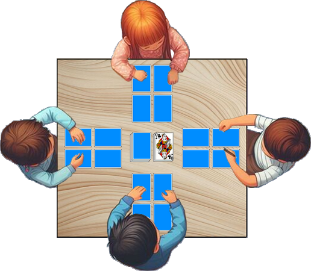

# Le Tamalou

> Source : [Le Tamalou](https://jeuxdecartes1.e-monsite.com/pages/jeux-de-pioche-defausse/le-tamalou.html)

♦ **Matériel** : Un jeu de 52 cartes, et 2 Jokers dans la variante 5)

♦ **Nombre de joueurs** : Entre 2 et 6 joueurs

♦ **Objectif** : Totaliser 5 points ou moins et moins de points que ses adversaires

♦ **Nombre de cartes pour chaque joueur** : 4 cartes, disposées en carré, face cachée, devant chaque joueur

♦ **Règle du jeu** : Le ***Tamalou***, également connu sous les noms de ***Cabo***, ***Gabo***, ***Kobo*** ou ***Dutch***, fait partie des variantes du [***Golf***](http://jeuxdecartes1.e-monsite.com/pages/jeux-de-pioche-defausse/le-golf.html) jouées avec des cartes à pouvoir. Le donneur distribue 4 cartes à chaque joueur, pose la pioche au centre, face cachée, et retourne une carte à côté, fondement de la pile de défausse. Chaque joueur dispose ses 4 cartes devant lui en carré (disposition qui ne doit pas changer en cours de jeu) et prend connaissance uniquement des deux premières cartes devant lui, qu’il doit mémoriser avant le début du jeu. Voici la disposition à 4 joueurs :

À son tour de jouer, au choix :

1) Le joueur prend la dernière carte de la défausse et l’échange contre une carte de son jeu (qu’il jette ensuite dans la défausse).

2) Le joueur pioche une carte et, après l’avoir regardée, l’échange contre une carte de son jeu (qu’il jette ensuite dans la défausse).

3) Le joueur pioche une carte et, après l’avoir regardée, la repose dans la défausse, en utilisant le pouvoir de cette carte le cas échéant :

- Si la carte est un 7 ou un 8, le joueur peut regarder au choix l’une des cartes de son jeu ;
- Si la carte est un 9 ou un 10, le joueur peut regarder une carte du jeu d’un adversaire ;
- Si la carte est un Valet ou une Dame, le joueur peut échanger à l’aveugle une carte de son jeu avec une carte du jeu d’un adversaire ;
- Si la carte est un Roi noir (♠Roi ou ♣Roi), le joueur peut échanger une carte de son jeu avec une carte du jeu d’un adversaire (carte qu’il a la possibilité de regarder avant de procéder, ou non, à l’échange).

Si un joueur exerce mal le pouvoir d’une carte, il passe immédiatement son tour et prend, sans la regarder, la première carte de la pioche, qu’il ajoute à sa disposition.

****Les appariements : À tout moment, un joueur peut jeter une, deux ou trois cartes de même valeur que celle visible dans la défausse, issues des cartes disposées devant lui. Si plusieurs joueurs ont une carte de même valeur à jeter, le plus rapide l’emporte ; le plus lent replace sa carte dans son jeu. En cas d’erreur d’appariement, le joueur concerné pioche une nouvelle carte et l’ajoute, sans la regarder, à sa disposition. Si jamais un joueur n’a plus de cartes dans son jeu lorsque vient son tour, il doit annoncer « ***Tamalou !*** » pour mettre fin à la manche, sans jouer.

Dès lors qu’un joueur pense que la valeur additionnée de ses cartes est ***inférieure ou égale à 5 points***, il peut annoncer « ***Tamalou !*** »****** à son tour de jeu. À ce moment-là, un dernier tour s’engage entre les joueurs, excluant l’annonceur, tour pendant lequel les échanges de cartes sont encore possibles. La manche se termine quand le dernier joueur a jeté sa carte (ou, éventuellement, après un échange ou un appariement). Chaque joueur retourne alors ses cartes devant lui et additionne ses points.

La valeur des cartes :

- **As, 2, 3, 4, 5, 6, 7, 8, 9 **et** 10 **: valeur numérique (de 1 à 10 points)
- **Valet **et **Dame **: 10 points
- **♠Roi **et** ♣Roi **: 15 points
- **♥Roi** et** ♦Roi **: 0 point

L’annonceur du ***Tamalou*** ne marque aucun point s’il est gagnant (c’est-à dire s’il totalise 5 points ou moins et moins de points que ses adversaires) et marque une pénalité de ***10***** ***points*** (qui s’ajoute, le cas échéant, aux points des cartes qu’il a dans son jeu) s’il est perdant. Il est commun de convenir d’un nombre de manches à l’issue duquel le joueur ayant le total de points le plus bas est déclaré gagnant.

---

♦ **Variantes ** :

1) On peut convenir d’une autre limite maximale de points pour l’annonce du ***Tamalou*** (par exemple ***7 points***) ou n’en fixer aucune (l’annonceur gagne une manche s’il totalise moins de points que ses adversaires).

2) Dans certaines versions du jeu, le Valet vaut 11 points, la Dame vaut 12 points et les Rois noirs valent 13 points.

3) Une règle supplémentaire stipule qu’à tout moment un joueur peut jeter une ou plusieurs cartes ***issues des dispositions de ses adversaires*** si celles-ci sont de même valeur que celle visible dans la défausse. Le joueur en question doit ensuite remplacer les cartes défaussées dans les jeux des autres joueurs par des cartes de son propre jeu ; mais attention, il n’a pas le droit de regarder les cartes de remplacement.

4) Pour plus de facilité, il est possible de jouer sans manches (c’est-à-dire sans compter les points de pénalité) : l’annonceur du ***Tamalou*** gagne s’il totalise un maximum de 5 points et s’il a moins de points que ses adversaires ; si l’une ou l’autre condition n’est pas remplie, c’est l’adversaire totalisant le moins de points qui remporte la partie. En cas d’égalité, l’annonceur est toujours perdant.

5) Les Jokers, s’ils sont utilisés, comptent ***- 1 point***.
