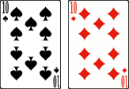

# Le Yami

> Source : [Le Yami](https://jeuxdecartes1.e-monsite.com/pages/jeux-de-pioche-defausse/le-yami.html)

♦ **Matériel** : Deux jeux de 32 cartes (sans Joker) à 2 joueurs, quatre jeux à 3 et 4 joueurs, et une grille de jeu

♦ **Nombre de joueurs** : Entre 2 et 4 joueurs

♦ **Objectif** : Totaliser le plus grand nombre de points en composant des séries et des combinaisons de cartes

♦ **Nombre de cartes pour chaque joueur** : 5 cartes

♦ **Règle du jeu** : Le ***Yami***, conçu par Max Gerchambeau vers 1980, est un mélange de ***Yam’s*** et de ***Rami*** qui manie habilement les combinaisons du ***Poker***. Un joueur distribue 5 cartes à chaque joueur, face cachée, pose la pioche au centre et retourne à côté la première carte, fondement de la pile de défausse. À son tour de jouer, pour améliorer son jeu, chaque joueur a le choix de prendre une carte de la pioche ou de la défausse ; il doit ensuite jeter une carte de son choix, gardant toujours 5 cartes en main. L’objectif est de réaliser le plus rapidement possible, et dans n’importe quel ordre, une série de 3 ou 4 cartes de même valeur mais de couleurs différentes ou une combinaison parmi celles indiquées dans le tableau (paire, double paire, brelan…) :

LES SÉRIES :

- **Une carte quelconque **(5 points)
- **La paire** (10 points) : Deux cartes de même valeur et de couleurs différentes.
- **Le brelan **(15 points) : Trois cartes de même valeur et de couleurs différentes.
- **Le carré **(20 points) : Quatre cartes de même valeur et de couleurs différentes.

LES COMBINAISONS :

- **La paire** (5 points) : Deux cartes de même valeur et de couleurs différentes.

- **La double-paire** (10 points) : Deux paires.

- **Le brelan** (15 points) : Trois cartes de même valeur et de couleurs différentes.

- **Le full** (20 points) : Une paire et un brelan.

- **Le carré** (25 points) : Quatre cartes de même valeur et de couleurs différentes.

- **La quinte** (30 points) : Cinq cartes qui se suivent.

- **L**a** couleur** (35 points) : Cinq cartes de même couleur et de valeurs différentes.

- **La quinte floche** (50 points) : Cinq cartes de même couleur qui se suivent.

Remarque : Dans les quintes et quintes floches, l’As peut remplacer le 6, autorisant la quinte : As - 7 - 8 - 9 - 10.

Pour abattre son jeu, le joueur doit attendre son tour ; s’il décide d’échanger une carte, il doit attendre le tour suivant. Dès qu’un joueur expose son jeu, il oblige les autres à le faire immédiatement. Les joueurs consignent alors sur leur fiche de jeu la série ou la combinaison effectuée. Les cartes sont ramassées, mélangées et redistribuées. Le jeu se joue donc en 16 manches et le vainqueur est celui qui totalise le plus de points, le total général maximum s’élevant à ***400 points***.

S’il veut marquer dans les séries, le joueur doit exposer un brelan ou un carré ; s’il veut marquer dans les combinaisons, il doit exposer l’une des combinaisons indiquées sur la fiche. Ses adversaires marquent selon leurs possibilités, même avec une seule carte dans une case libre des séries ou avec une combinaison quelconque dans une case libre des combinaisons. Mais s’ils n’ont absolument rien à marquer, ils doivent annuler la case libre de leur choix dans les séries ou combinaisons (excepté la case BONUS). Quand une case est remplie, on ne peut plus y revenir ! Enfin, un joueur totalisant 90 points ou plus – 105 ou plus à 2 joueurs – dans les séries, se voit offrir un bonus de 50 points.

Voici la grille de jeu : [Le Yami (grille de jeu)](https://jeuxdecartes1.e-monsite.com/medias/files/le-yami-grille-de-jeu-.pdf) (83.16 Ko)
